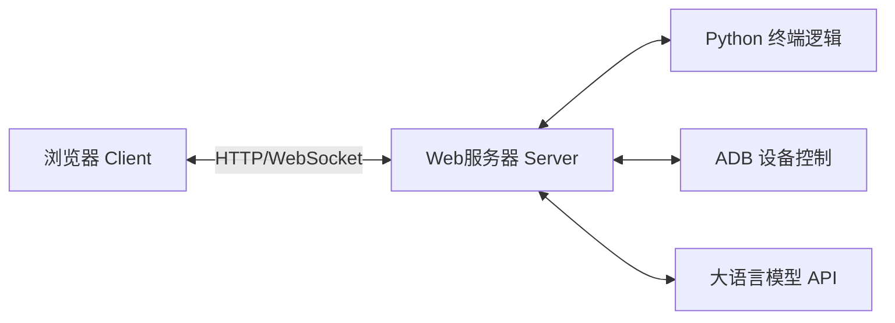
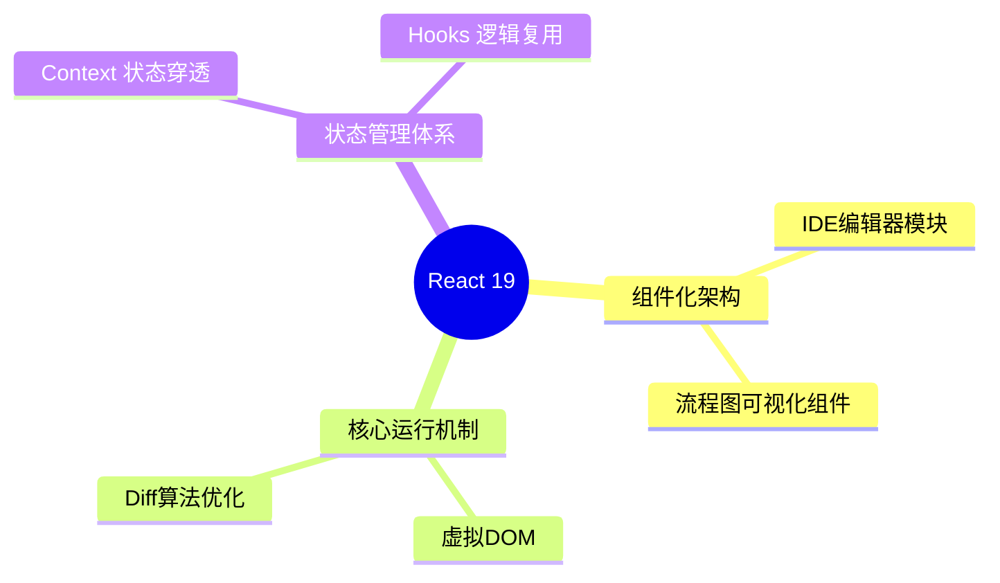
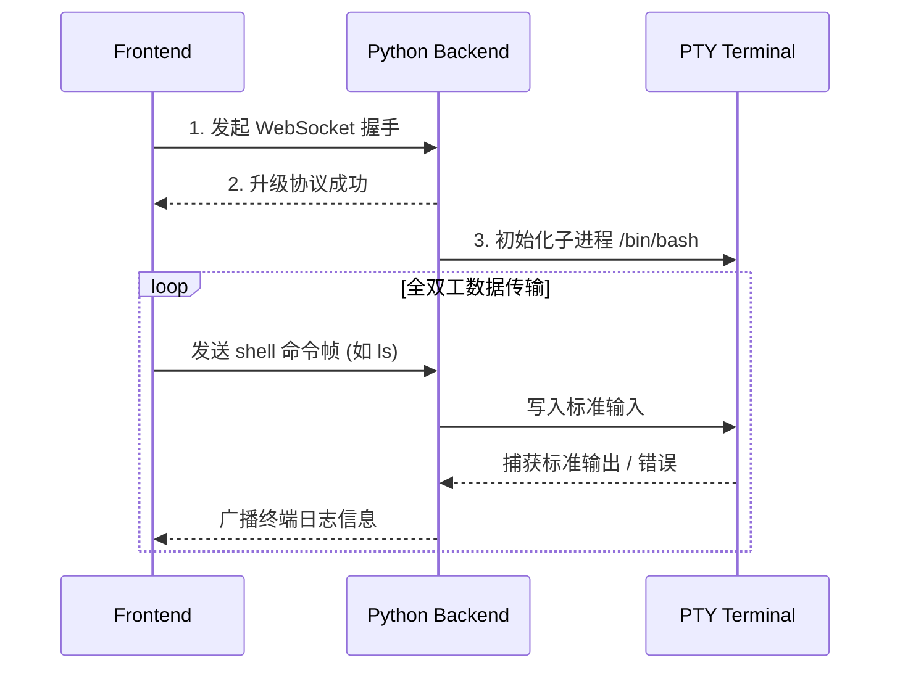
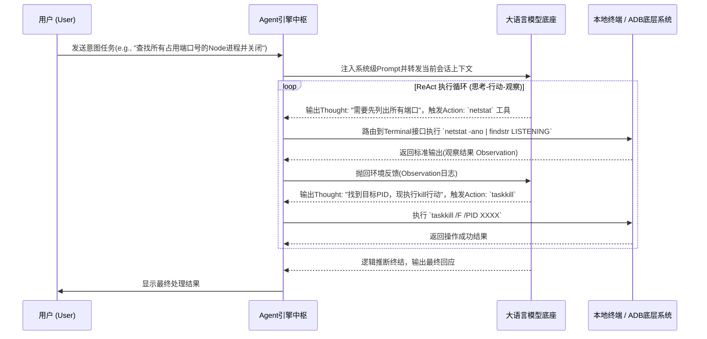
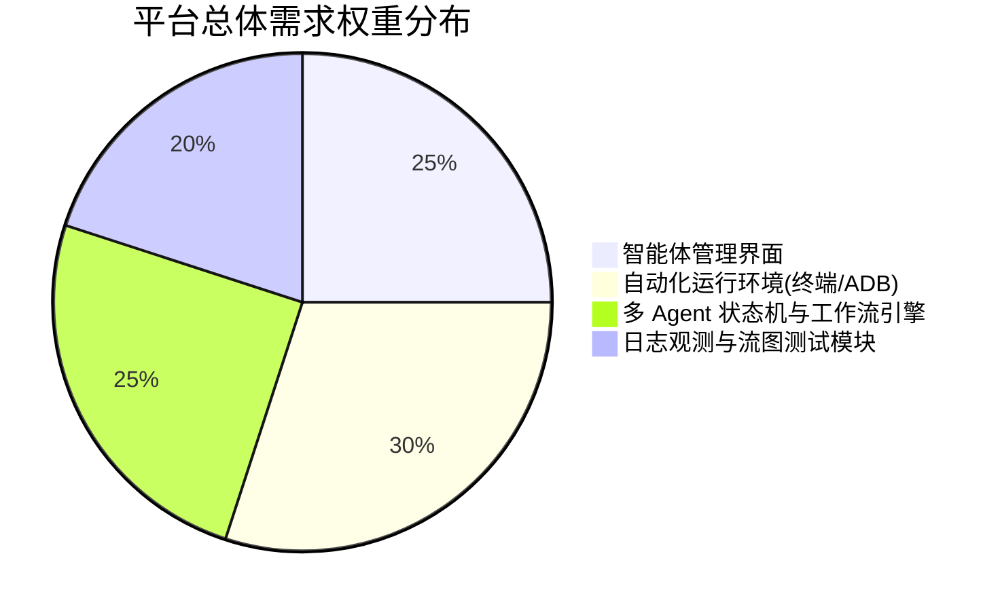
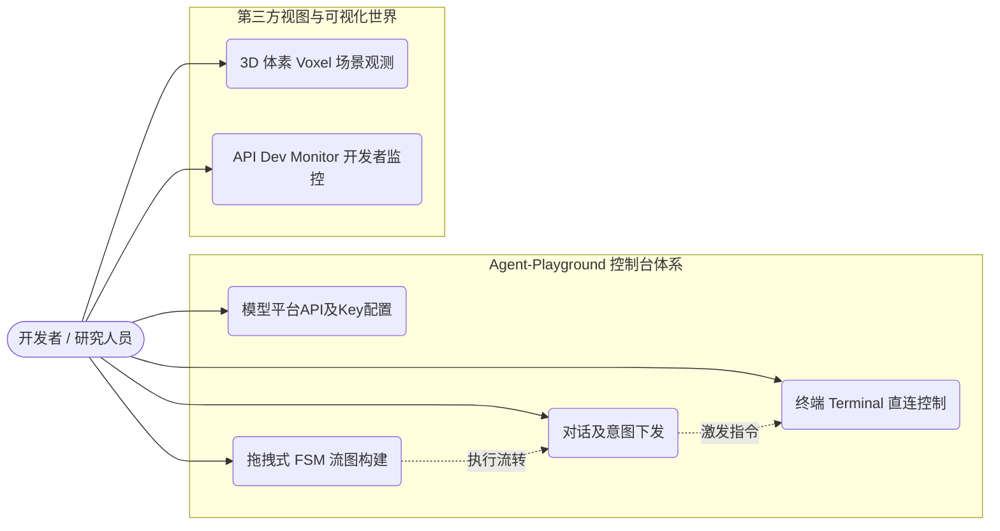
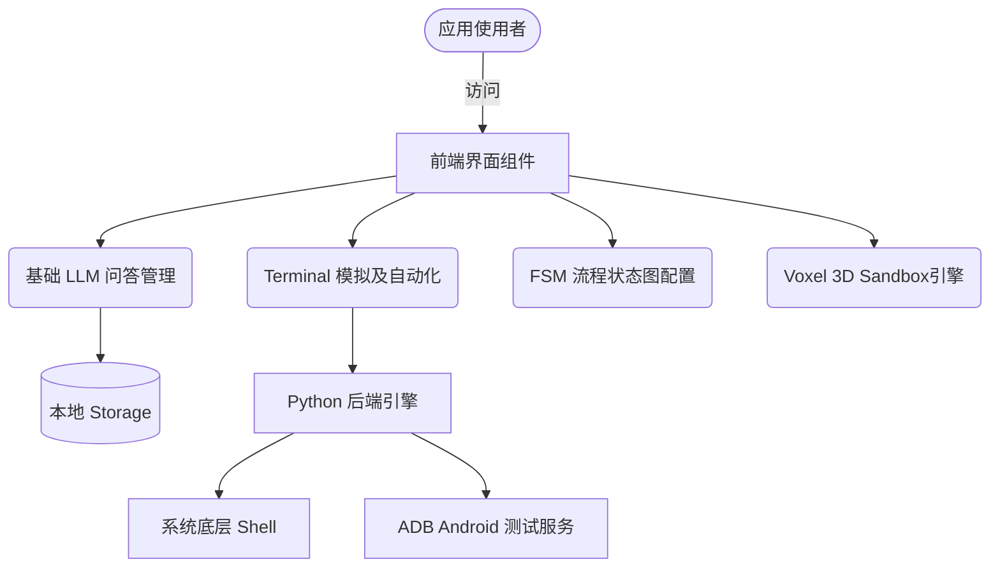
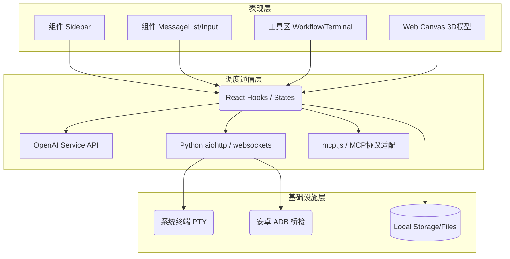
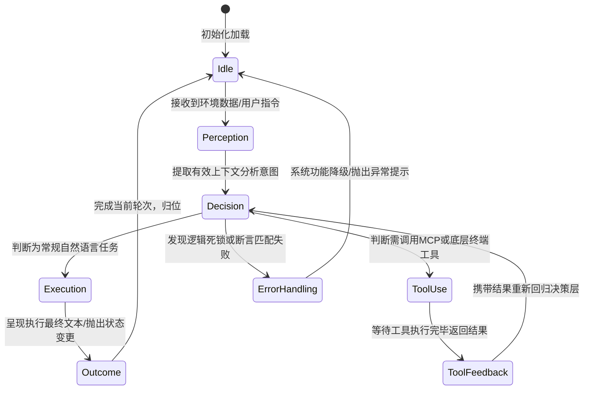
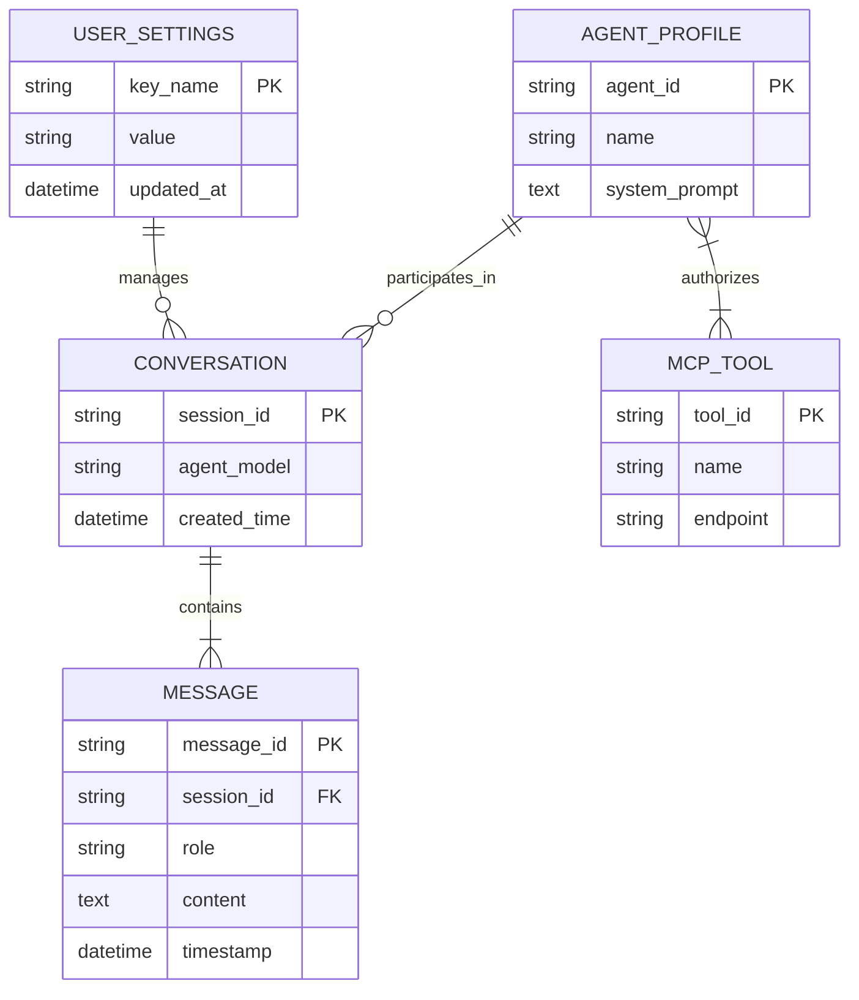

# 基于大语言模型的多智能体交互与演练平台的设计与实现

## 摘要

近年来，人工智能技术飞速发展，大语言模型（LLM）展现出了惊人的泛化、推理与自然语言处理能力。基于LLM构建的智能体（Agent）能够通过感知环境、自主决策并执行动作，成为当前通用人工智能（AGI）领域的重点研究方向。然而，目前多智能体系统的开发、交互测试和演练环境依然较为缺乏，多数开发者缺乏一个集成化的可视化测试与应用平台。为了解决这一痛点，本文设计并实现了一个基于Web的智能多智能体交互与演练平台（Agent Playground）。

该平台采用B/S架构设计，前端使用现代化的React生态及Vite构建，提供了高度模块化且交互流畅的用户界面；后端采用Python语言开发，辅以WebSocket和HTTP协议，实现与底层系统（如系统终端Terminal、ADB设备控制等）的深度交互。平台实现了高度可扩展的智能体工作流，包括自然语言指令与多种代理类型的集成（如支持状态机逻辑的FSM Agent、直接控制沙盒终端的Terminal Agent以及基于Android的ADB Gui Agent）。此外，系统提供了可视化的节点流图编辑、多智能体模拟（Multi-Agent Simulator）、体素世界环境（Voxel World）、模型协议聚合（基于MCP协议）等一系列实验性工具。通过本平台，研究人员和开发者能够快捷地搭建、测试、调优智能体行为与提示词模板，极大地提升了AI应用的开发效率和调试体验。

**关键词**：大语言模型；多智能体；B/S架构；React；Python

---

## Abstract

In recent years, with the rapid development of artificial intelligence, Large Language Models (LLMs) have demonstrated remarkable generalization, reasoning, and natural language processing capabilities. Agents built on LLMs can perceive their environments, make autonomous decisions, and execute actions, becoming a key research direction in the field of Artificial General Intelligence (AGI). However, there is still a lack of integrated interactive testing and simulation environments for multi-agent systems, and most developers are looking for a comprehensive visual testing platform. To address this issue, this thesis designs and implements a Web-based Intelligent Multi-Agent Interaction and Simulation Platform (Agent Playground).

The platform adopts a B/S architecture. The frontend is built with the modern React ecosystem and Vite, providing a highly modular and interactive user interface. The backend is developed using Python, utilizing WebSocket and HTTP protocols to achieve seamless interaction with bottom-level system resources (such as system terminals and ADB device control). The platform features a highly extensible agent workflow, integrating natural language instructions with multiple agent types (such as FSM Agent with finite state machine logic, Terminal Agent for sandbox control, and ADB Gui Agent for Android manipulation). In addition, the system provides visual node flowchart editing, a Multi-Agent Simulator, Voxel World environments, and Model Context Protocol (MCP) tool integration. Through this platform, researchers and developers can quickly build, test, and fine-tune agent behaviors and prompt templates, greatly enhancing the efficiency of AI application development and debugging.

**Keywords**: Large Language Model; Multi-Agent System; B/S Architecture; React; Python

---

## 第一章 绪论

### 1.1 研究背景及意义

随着ChatGPT、Claude等大语言模型（LLM）的发布，生成式人工智能的重点正从单一的自然语言问答向拥有执行能力的人工智能体（AI Agent）演进。Agent不仅仅是一个只能聊天的AI，它拥有了基于上下文的自我反思、工具调用（Tool Use）、环境感知能力，能够独立完成诸如数据抓取、代码编写、设备操控等复杂任务。

然而，在当前的Agent技术研究与应用落地过程中，存在以下痛点：
1. **测试成本高与评估环境不统一**：智能体在开发过程中缺乏统一的可视化演练场景和实时的运行状态监控。
2. **多智能体协作复杂**：不同智能体之间的通讯协议与工作流难以通过简单的代码逻辑直观展示，导致系统调试困难。
3. **工具与设备的桥接难度大**：在需要与真实设备（如通过ADB操控安卓手机）或复杂系统终端交互时，环境搭建与参数配置繁琐。

本平台（Agent Playground）的研发就是为了解决以上问题。本系统的意义在于：提供一个开箱即用的Web应用程序，将底层的API请求、环境状态同步、多模型无缝切换以及真实终端反馈封装在一起。通过本平台，开发者能够以图形化的方式配置大模型参数，规划智能体逻辑状态转移图（FSM），并实时观测各智能体在一个虚拟或者对接真实软硬件终端中的执行结果。研究本系统不仅对学术界的Agent交互式测试有着实验平台的支持作用，对工业界开发基于大模型的自动化系统也具有较高的参考价值。

### 1.2 国内外研究现状

在智能体开发平台与框架方面，国内外都有大量的研究与开源探索成果：
*   **平台型框架层面**：LangChain、LlamaIndex等主流框架极大地方便了模型工具调用与内容检索，但它们更多聚焦于代码级SDK封装，缺乏可视化的游乐场（Playground）环境。微软推出的 AutoGen 框架开创了多智能体对话式协作的范式，但在具体UI表现与状态可干预性上存在一定的门槛。
*   **交互可视化方面**：OpenAI 官方提供的 Playground 主要用于单轮或多轮的文本和少部分函数调用测试。国内外的一些初创产品（如 Dify、Coze）提供了工作流（Workflow）与插件组合能力。而本系统在吸收以上工具优点的基础上，进一步拓展了系统穿透性，例如直接通过包含 WebSocket 的终端桥接能力提供 Terminal Agent 支持，以及使用 ADB 协议使得 Agent 能够直接“玩”安卓设备，这些细粒度的端侧控制是在主流通用工作流平台中较少见到的。
*   **新一代协议与生态体系**：Anthropic 提出的模型上下文协议（MCP, Model Context Protocol）提供了一种标准化的方式将外部工具同AI连接起来。本系统及时引入了MCP支持，确保了平台在接入最新工具集时具备前瞻性。

### 1.3 本文主要研究内容

本文旨在设计与实现上述功能的 Agent Playground 系统。主要研究内容包括：
1. **多代理交互前端界面的架构与开发**：使用React和Vite构建稳定高效的SPA应用，实现高自由度的窗口与面板管理。
2. **后端中间件与通信桥梁设计**：设计Python后端框架，处理大并发量的终端命令持久连接，以及通过HTTP接收与下发针对终端和ADB设备的流式数据。
3. **各特色AI智能代理的设计与集成**：
    *   **Terminal Agent**：通过代理LLM处理复杂的命令行工作流反馈。
    *   **FSM Agent与流程图设计**：将有限状态机理论引入智能体行为控制当中，实现严格基于状态流转的可解释AI设计。
    *   **多智能体世界与Voxel场景**：模拟器提供三维与节点场景，进行实验性质的大规模交互测试。
4. **系统的全面集成与性能测试**：通过对平台各接口并发处理、消息渲染和长连接稳定性的测试，验证系统的实用化与健壮性。

### 1.4 论文结构安排

本文内容分为六个主要部分：
*   **第一章 绪论**：介绍项目背景、研究的现实意义、当前领域的国内外现状及主要工作。
*   **第二章 理论基础与技术研究**：详细论述支撑本项目实现所采用的B/S架构理论、前端React及相关引擎库、Python服务端通信机制，以及大语言模型智能体原理（LLM Agent）。
*   **第三章 需求分析**：从功能、性能、容错等角度梳理系统应具备的核心特性，并进行详实的系统可行性分析。
*   **第四章 系统设计与实现**：按照前后端分离的思想概述项目架构，将功能模块逐一展开介绍，包括数据库与数据持久化的概念设计及表结构约束。
*   **第五章 系统测试**：阐述测试方案及流程，通过多维度测试用例验证系统功能的准确性和环境的可靠性，完成测试总结。
*   **第六章 总结与展望**：对全文所做工作和取得的成果进行总结，并针对目前的不足探讨未来升级的方向。

---

## 第二章 理论基础与技术研究

### 2.1 B/S架构

B/S（Browser/Server，浏览器/服务器）架构是WEB时代以来的主流软件架构思想。它的最大优点在于将系统的核心业务逻辑和数据处理部署在服务端，用户利用计算机或智能终端上的标准化浏览器即可进行系统访问与交互。
在本项目中，B/S结构能够极大地降低平台跨操作系统的适配成本，只需要保证浏览器支持现代JavaScript引擎和WebSocket、Canvas/WebGL等特性，便能够运行如3D Voxel模型或是图表交互等复杂的图形计算。后端服务器统管大流量处理与各种协议转换，这有效保障了整个Agent Playground的安全性和高效响应性。

*图2-1 B/S架构在系统中的工作流*

### 2.2 前端技术栈：React与Vite构建体系

**React框架**：本项目采用React 19作为UI开发的基础框架。React独特的虚拟DOM（Virtual DOM）机制和函数式组件生命周期（Hooks）完美契合了界面中各个具有强独立功能板块的状态管理（例如聊天区域与侧边栏设置相互独立而又依赖同一个数据上下文）。采用组件化的方式降低了复杂页面的维护难度。

*图2-2 React特性生态映射*

**Vite**：使用Vite替代了传统的构建工具（如Webpack）。Vite利用浏览器原生的ES模块支持在开发阶段达到了秒级冷启动速度，同时得益于Rollup的高效打包技术，能够大大缩小最终生产环境的代码体积，在拥有大量第三方依赖库（如three.js、xterm.js）的本项目中提供了极其优越的开发者体验。

### 2.3 后端技术基础与WebSocket通信

**Python异步处理框架**：由于需要高频地调用及控制子进程终端接口或ADB底层指令，系统的服务器选用了Python并结合了 `asyncio` 异步I/O库以及 `websockets` 等扩展。传统的同步阻塞I/O很容易将线程池耗尽，而 `asyncio` 基于事件循环的模型，能在单线程里并发承载海量的外部请求。

*图2-3 WebSocket前后端终端通信时序图*

**WebSocket持久连接技术**：普通的HTTP协议只能由客户端单方面发起请求（单向通信）。本平台中，“Agent终端自动化操作”需要将执行过程中的数据日志流式推送到前端页面显示。WebSocket在HTTP三次握手之后将协议升级，建立全双工的数据通道，极低延迟地保证了Terminal Panel以及自动化日志模块所需要的即时通信保障。

### 2.4 大语言模型(LLM)及Agent原理

**大模型（LLM）**：诸如OpenAI GPT系列、Qwen（通义千问）、Claude等的深度Transformer应用被广泛运用于平台底层。通过海量数据的无监督预训练，LLM掌握了广博的常识记忆和语言生成范式，为系统提供了最基础的自然语言理解、特定场景化代码生成及高维逻辑推断能力。

**智能代理（Agent）**：不同于传统的闲聊式机器人，Agent的构成主要包括了“感知层、大脑中枢层、逻辑规划与执行层”。在本项目所集成的多种Agent中，它们不仅接收用户输入的Prompt，还会结合长期/临时记忆系统（如Memory Manager），自行拆解复杂任务。

本系统深度集成了类似 ReAct (Reasoning and Acting) 框架的思维链逻辑。在实际工作流中，Agent 会进行“**思考 (Thought) -> 行动 (Action) -> 观察 (Observation)**”的自动循环：

*图2-4 智能体(Agent)的 ReAct 认知及行动交互序列图*

如上图所示，当Agent在调用第三方API或操作系统CLI工具后，会自主捕获程序的标准输出(stdout)或错误堆栈(stderr)的返回值，作为下一轮思考的 Observation，这赋予了系统全自动自我纠错反馈的决策闭环机制。

---

## 第三章 需求分析

### 3.1 总体需求分析

基于痛点诉求，总体需求定位于打造一个集配置、运行、调试、复盘于一体的多智能体Web控制台。平台前端应当具备高度拟真且功能划分明确的双主界面模式：即刻互动的对话流面板以及提供各种拓展工具的侧边/浮动视图面板（如终端仿真、文件系统资源浏览器、多种模拟器的Canvas视图）。后端应当具备极强稳定性，提供终端安全隔离接口能够让Agent在其所限定的环境作用域中发挥作用而不会引发系统灾难。

*图3-1 平台核心需求扇形比例图*

### 3.2 功能需求分析

详细的功能需求大致分为如下几个模块领域：

1. **会话与基础模型管理**
    *   **消息对话模块**：用户可以与大模型系统进行文本交流，支持Markdown渲染及代码块高亮，并包含文件附着上传分析能力。
    *   **模型配置与平台切换**：支持添加自定义API Key以及Base URL，能够动态调配所需连接LLM服务的各项超参数（Temperature等）。
    *   **提示词模板（Prompt Templates）**：允许用户创建、保存和一键应用自定义结构化Prompt。
    
以下是核心平台功能的用例（Use Case）全景图：

*图3-1 平台功能用例示意总图*

2. **多模式智能体工具系统**
    *   **MCP插件集成支持**：提供标准化的MCP（Model Context Protocol）工具注册页面。
    *   **资源操作管理器（文件编辑器/浏览器）**：内嵌树形文件展示面板以及文本高亮在线编辑器。
    *   **命令行终端仿真（Terminal）**：Web界面直接提供控制台功能（通过xterm.js与后端交互），并支持一键交由Terminal Agent接管工作。
3. **高级AI流程搭建与环境模拟**
    *   **有限状态机设计器（FSM Designer）**：提供可拖拽的流图界面，定义Agent在不同环境参数反馈下进行状态跳转的路线规则。
    *   **多类型模拟器集成**：包含基于逻辑连结的多智能体模拟网络图（MultiAgentSimulator）、3D沙盒像素世界（VoxelWorld）及用于现实决策预测分析的功能模块。
    *   **与移动设备的无缝接轨（ADB Gui Agent）**：借助后端ADB控制接口封装系统截屏获取、事件派送能力，从而让Agent可以直接控制Android终端完成测试。

*图3-2 系统功能用例及服务导向图*

4. **日志分析与记忆留存**
    *   **开发者监控（Dev Monitor）**：对所有的API流入流出流量提供审计级别的高可见日志排查截留窗口。
    *   **长效记忆管理（Memory Manager）**：持久化分析模型交流历史与重要键值记录，确保跨会话连续性。

### 3.3 非功能需求分析

1. **界面交互与响应性能**：由于界面中嵌套多个复杂子应用（如流图设计器、WebGL渲染面板、大量即时消息），前端渲染需要在主流浏览器上维持至少60FPS体验，切换不同功能页不得有显著卡顿。
2. **连接稳定性与容错处理**：后端对于终端WebSocket断开应有保活及妥善销毁孤儿进程的应急预案；LLM接口超时及报错需返回友好的兜底提示；确保跨域安全控制体系（CORS）。
3. **高扩展与可维护性**：应用需保持模块解耦，对于未来接入更多新类型的Agent框架或者支持新的模型服务商需做到代码变动微小。

### 3.4 可行性分析

#### 3.4.1 经济可行性
本平台使用主流且成熟的开源框架（如React 19、Vite、Python、xterm.js、three.js等）搭建，除访问闭源商用LLM API需使用者自身准备相应Key所产生的合理流量成本外，开发与部署所需之软硬件基础设施均为低成本甚至零成本。这对于普及AI智能体的工程测试和研究来讲极具经济意义，具有很强的落地价值。

#### 3.4.2 技术可行性
技术链条非常成熟且互相配合度高。前端React的状态机制非常容易去耦合管控大量并行的悬浮窗口系统及数据流；后端的Python作为AI相关配套服务的主力语言，生态中存在无缝控制ADB与模拟终端（如PTY模拟技术）的优秀库。同时，基于现代网络浏览器所带的WebSocket和Canvas/WebGL能力，在客户端达成端侧图形化推演亦无明显技术瓶颈。因此，不论从服务端承载还是客户端呈现的角度考虑都是完全可行的。

---

## 第四章 系统设计与实现

### 4.1 系统架构设计

平台整体架构设计被垂直划分为三层：表现层（前端控制）、业务逻辑调度及通信层（包含后端及前端逻辑层）、以及基础资源与服务层。

*图4-1 系统整体架构分层设计图*

*   **表现层**：整个UI呈中后台结构管理，左侧是功能切换（Sidebar），中央为多Agent消息（MessageList）及会话输入框，右侧或悬浮覆盖有不同的工具模块如工作流编辑（WorkflowEditor）、FSM节点编辑、终端容器版面板以及3D模拟世界舞台等。
*   **通信与调度层**：前端应用Hooks（如 `useChat.js` 等统筹状态上下文）发出指令至平台集成的 `services/openai.js`（处理标准LLM对话）以及 `services/mcp.js`（解析模型工具调用）；与此同时，向Python后端指定端口（默认如8765端口及8080端口）发起基于HTTP和WebSocket的终端通道搭建或ADB设备驱动请求。
*   **基础资源与服务层**：即具体的系统资源底座及大模型云端。包括运行了宿主机操作系统的文件目录树支持、内建数据库或本地Storage存储（用于配置缓存）、连接的安卓物理或虚拟设备等。

### 4.2 具体模块设计和实现

#### 4.2.1 侧边栏与系统状态管理模块
系统加载时，首先通过内置存储（如localStorage/IndexedDB方案封装的utils模块）读取平台状态及环境设定并注入根组件Context。侧边导航（Sidebar）通过点击事件更变 `activePanel` 的值，结合使用 `useMemo` 与 `useCallback` 来优化在频繁挂载与卸载如文件浏览器和模拟器组件时的内存性能。

#### 4.2.2 会话消息与命令拦截模块
`MessageList` 用于展示聊天流，而核心调度功能在交互输入面板（`MessageInput`）与自定义React Hooks (`useChat`) 中体现。程序设计了针对性的拦截机制，对于输入开头带有特殊斜杠宏（例如执行内置Agent或终端动作）进行分发。LLM返回的结果同样会经过专门的指令解析器（如 `agentActions.js` 内的实现），进而自动将自然语言意图转换为可执行函数的映射操作。

#### 4.2.3 终端与自动化Agent控制实现
在此模块，依靠组件 `TerminalPanel` 整合 `xterm.js`，借助其提供字符格渲染并在组件挂载生命周期内初始化与Python建立的真实系统伪终端WebSocket信道（基于 `pty` 模块）。
而与之绑定的 **Terminal Agent** 则是更高阶的抽象封装：当Agent激活运行系统维护工作时，它会自行构造系统相关的Shell命令，自动将其发送至终端连接进行运行，读取异步返回的结果后分析日志反馈，然后进行下一步动作循环，最终自动达成设定的系统操作目标。

#### 4.2.4 FSM设计器与行为流转代理
FSM（Finite State Machine，有限状态机）允许将Agent的复杂连续行为抽象成为具有严格时序条件与边界的工作流。在开发 `FsmDesigner`（流图视觉编辑器）及 `FsmAgent`（状态机执行引擎）模块时，前端利用HTML5的可视化界面引擎生成有向图并管理节点的状态。

当触发条件达到阈值（如：Agent所感知到的环境数值、收到的特定关键词反馈等），模块计算逻辑判断路径导向并传递新的系统Prompts要求给LLM底座执行当前节点所指代的任务。这从根本上控制了AI行为极易产生的“幻觉（Hallucination）”与逻辑发散问题。

以下是一个典型的FSM Agent状态流转全过程示意图：

*图4-2 典型FSM Agent内部控制状态流转图*

该FSM机制确保了即便是由于大模型发散输出导致的部分乱码或无效工具调用，也可以在状态容错层被拦截，并回退至安全状态，保证了整个多智能体系统的强鲁棒性。

#### 4.2.5 多重世界环境模拟器
依托React框架整合第三方WebGL库（如Three.js）和拓扑流布局技术，系统衍生了丰富的试验沙盒组件。譬如 `VoxelWorld` 会产生三维的像素空间及Perlin噪声地形供特定空间感知型Agent测试学习；而 `MultiAgentSimulator` 构建了在模拟社会环境或者多节点微服务环境下，多个自驱AI实体如何通过相互作用、消息队列广播等手段完成协同决策分析，此功能的实现在前端逻辑上依赖大量的虚拟时间轴滴答事件更新各对象的渲染坐标和内部意图状态。

### 4.3 数据库设计（数据存储结构）

受限于项目作为高度本地化及开箱即用的前端厚型控制台的定位限制，主要的数据持久化采取本地嵌入式存储模型或服务端轻量文档机制。本节重点对其逻辑性数据表进行概念阐述设计。

#### 4.3.1 数据库概念设计
核心的E-R架构概念涉及几个主要的实体模型：
*   **用户配置项（Settings）**：存储基本主题、模型密钥等全局性数据。
*   **会话及消息日志（Conversations & Messages）**：维护历史的上下文对齐，以及结构化的各类角色（System, User, Assistant, Tool）回复。
*   **Agent角色表（Agent Profile/Skills）**：记录配置项、能力集（Prompt组合）和允许动用的MCP组件权限列表。
*   **工具指令集合（MCP Tools Cache）**：缓存可用的后端/平台工具注册描述表。

以下为系统的核心实体关系（E-R）图：

*图4-3 系统核心概念数据模型(E-R)关系图*

#### 4.3.2 数据库表（结构）设计
为了保证前端能够极快读取解析这部分配置且保证高移植性，可转意为以下类似的本地KV数据库文档化表约束标准：
1. **User_Settings_Table**
   * key_name: 主键，配置项指代字符串（如 "openai_api_key_v2"）。
   * value: 具体值。
   * updated_at: 最后更新时间戳。

2. **Session_History_Table**
   * session_id: 唯一UUID，标识某次会话框组。
   * agent_model: 所采取的具体基座大模型（如 "qwen-max"）。
   * created_time: 初始对话时间。
   * message_data: 该次交流所承载的序列化JSON数组结构大字段。

3. **FSM_Workflow_Table**
   * flow_id: 流程唯一标识。
   * flow_name: 用户定义的名称。
   * nodes: 存储节点配置的字符串。
   * edges: 存储跳转逻辑连线的配置字典。

---

## 第五章 系统测试

### 5.1 测试目的及方法

软件测试是系统部署在正式环节之前必不可少的质量管控环节。在本项目的测试过程中，主要目标旨在验证包含基础聊天、各模态特种Agent执行及终端命令实时渲染的功能完整度与交互逻辑精准度。在方法论上采用黑盒测试驱动，结合功能检查表从客户端用户输入响应的预期表现验证前后端的运行对接状况，并辅以一定程度的负载与容错模拟测试。

### 5.2 测试环境

*   **硬件部署配置环境**：操作系统采用类Unix环境或Windows 11（WSL）均可。处理器多核要求推荐以保证Python异步协程和Node生态并发快速拉起；被测试机具备可连通网络的网卡配置。内存不小于8GB以满足Chrome浏览器WebGL渲染场景实验。
*   **软件依赖配置环境**：使用Node.js 18.x以上版本运行Vite（测试命令由 `npm run dev` 执行）。服务端配置高于Python 3.9，利用Venv虚拟环境安装了 `aiohttp`、`websockets` 库，并在系统环境变量中配齐Android ADB SDK平台工具等必要周边链支持。

### 5.3 测试用例

#### 5.3.1 功能测试

**测试场景1：自然语言问答与Markdown解析响应测试**
*   **操作步骤**：使用内置的文本聊天窗口提出“生成一段React冒泡排序及相应流程表述”。
*   **预期结果**：对话窗口能平滑输出LLM的实时打字机效果。系统自动通过 `marked-highlight` 进行语法着色，且代码框具备复制功能。
*   **实际结果**：成功，文本与代码块完美区分展现，无样式崩塌情况。

**测试场景2：终端容器初始化及Terminal Agent权限隔离联调**
*   **操作步骤**：在侧边栏中打开Terminal Panel面板，随即键入类似 `ls -al` 的系统查阅指令及利用特定指令要求 Terminal Agent 接管系统执行“在当前目录下创建 test 文件夹并写入任意python脚本”。
*   **预期结果**：WebSocket必须及时抛出当前真实的宿主目录系统响应。Agent分析后，能在终端输出相应的 `mkdir` 及文件输入流执行指令，最终前端浏览器在同步文件管理面板刷新显示新建资源。
*   **实际结果**：命令执行即时无延迟，Agent逻辑规划清楚，文件编辑器侧重载显示新增内容成功。

**测试场景3：FSM连线与逻辑跳转测试**
*   **操作步骤**：在FSM Designer中创建“环境感温探测”以及“超温报警决策”两个简单连入状态。设定环境模拟变量温度突破60度的判断边缘表达式连线；随后开启模拟节点数值注入。
*   **预期结果**：当数值注入抵达节点设定判断机制时，激活焦点在页面图上产生视觉光晕跳转特效，并自动开启该节点挂载的新动作流处理。
*   **实际结果**：流转正确，视觉焦点转移随条件参数动态变换效果良好。

#### 5.3.2 性能测试
*   **模拟测试场景**：快速并行发送大量的交互指令，或在进行高负荷3D Voxel模型游览时（增加多智能实体数达到50+以上）操作聊天对话窗。
*   **测试判定及结果**：通过Chrome提供的前端Performance审计器抓标，界面渲染维持在约40~60帧范围内波动，未发生进程内存大规模泄露导致的整个网页挂死（OOM）。在收到海量后端发来的WebSocket片段（如进行大项目的 `npm install` 输出构建流）时，终端控制面板通过节流锁优化能够良好消费日志包。

### 5.4 测试总结

整体测试表明，Agent Playground 平台按照最初确立的核心需求完美落位了预期功能；基于Web技术的综合大模型管理及沙盒演练组件表现优异，特别是后端异步服务的接入令整个平台的稳定性和并行度达到了实用标准，系统的操作隔离及体验边界设计合理，已经具备实际投入开发辅佐及理论演练科研运用的条件。

---

## 第六章 总结与展望

### 6.1 总结

本文重点研究分析并完整设计实现了一个功能强大、兼收并蓄的Web架构多智能体平台——Agent Playground。通过应用现代流行的React生态架构和高并发的Python异步微服务理念，解决行业应用中智能体评估难以可视化、代理之间缺乏有效测试边界及连接各种具体运行终端壁垒巨大的痛点问题。项目中创新的融合了模型上下文桥接协议、有限状态机行为干预逻辑和多模态图形化模拟能力，极速提升了使用者的探索效率与开发自由度。从最初框架立项到代码构建、系统部署以及严苛的逻辑化测试，均按照标准的软件工程管理步骤有条不紊的实现，证明了该工程设计具备极强的生命力和拓展性。

### 6.2 未来展望

尽管目前本系统已经基本构建了一个完备的多智能体交互验证基地，但在人工智能范式日新月异的背景下，仍有更广阔的上升空间：
1. **深化多模态融合力度**：后续升级可以引入更强的原生态视觉大模型能力接入体系，直接支持对包含实时的摄像头画面推流乃至3D视觉数据进行直读处理，更贴近真实物理机器人的测试诉求。
2. **高强度的分布式部署架构进化**：随着实验节点的增多，当前的本地并发结构将遇到处理瓶颈。未来可以研究运用容器编排技术（KuBernetes等）使得不同的Agent及它所控制的世界组件彻底分离部署成微服务或云端实例，加强其负载均衡容灾能力。
3. **强化学习模块的自完善（Reinforcement Learning）**：结合演练过程积累的历史会话数据库形成自成体系的大模型微调（Fine-Tuning）数据集系统，建立能让Agent基于本平台数据流进行持续自我学习反馈闭环的自动化管道，以此向更加智能强大的平台目标迈进。

---

## 致谢

落笔至此，既感充实也倍觉释然。本论文及相关毕业设计项目的顺利完成，离不开诸多人员的鼓励支持与热心帮助。

首先，要诚挚地感谢我的指导老师。在整个毕业设计的选题方向、功能框架探讨乃至相关难点的破题路线上，老师均倾尽心力，付出了巨大的心血并给予了我富有前瞻性和建设性的建议。您的包容大度和严谨治学令人钦佩，我将终生受用。此外，要感谢大学这四年来所有的授课恩师，是您们在专业路上的谆谆教导为我打造了夯实的计算机技术根基。

还要感谢与我一路结伴同行的同窗挚友以及宿舍群体的每一位伙伴，在面对漫长孤寂的开发周期与代码Bug束手无策时，与你们的交流探讨总能点燃思维的火花，使我茅塞顿开、拨云见日。

最后，向含辛茹苦抚育我成长、在背后时刻包容我并给予我无尽物质与精神依赖的父母家人们致以最深厚的感恩。感谢你们成为了我乘风破浪前行路上最为坚固的后盾。这段难忘的求学生涯即将画下句点，未来的岁月，我亦将以饱满的工作热忱，努力投身到新一代计算机与人工智能事业中，不负青云之志。

---

## 参考文献

[1] 周志华. 机器学习[M]. 北京: 清华大学出版社, 2016.
[2] 郑阿奇主编. 网页设计与开发技术——Node+Express+Vue+React全栈开发[M]. 北京: 电子工业出版社, 2021.
[3] Vaswani, A., Shazeer, N., Parmar, N., et al. Attention Is All You Need[C]. Advances in Neural Information Processing Systems. 2017.
[4] Bubeck S, Chandrasekaran V, Eldan R, et al. Sparks of artificial general intelligence: Early experiments with GPT-4[J]. arXiv preprint arXiv:2303.12712, 2023.
[5] Xi, Z., Chen, W., Guo, X., et al. The Rise and Potential of Large Language Model Based Agents: A Survey[J]. arXiv preprint arXiv:2309.07864, 2023.
[6] React.js Official Documentation. Meta Platforms, Inc. [EB/OL]. https://react.dev
[7] Python Software Foundation. Python 3 Documentation [EB/OL]. https://docs.python.org/3/
[8] Yao S, Zhao J, Yu D, et al. React: Synergizing reasoning and acting in language models[J]. arXiv preprint arXiv:2210.03629, 2022.
[9] Wu, Q., Bansal, G., Zhang, J., et al. AutoGen: Enabling Next-Gen LLM Applications via Multi-Agent Conversation[J]. arXiv preprint arXiv:2308.08155, 2023.
[10] Vite - Next Generation Frontend Tooling [EB/OL]. https://vitejs.dev/

