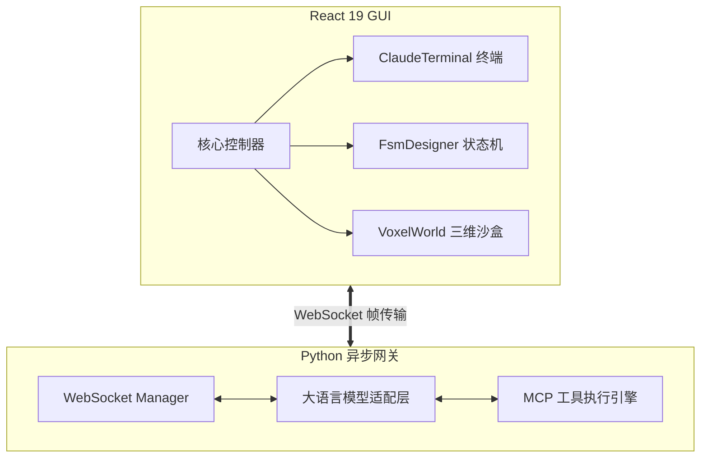

# 基于大语言模型与多智能体协同的可视化沙盒系统设计与实现

## 摘要

随着人工智能和自然语言处理技术的飞速进步，以大语言模型（Large Language Models, LLMs）为核心的自主智能体（Autonomous Agents）已普遍成为学术界与工业界关注的焦点。传统的智能体开发通常依赖于命令行接口或分散的代码脚本，缺乏统一的可视化调试环境，导致多智能体协作、工具调用（Function Calling）以及物理世界仿真等复杂场景的测试门槛较高。为解决上述问题，本文设计并实现了一套基于 B/S（Browser/Server）架构的智能体实验沙盒系统（Agent Playground）。

本文首先对大语言模型的推理机制、有限状态机（FSM）模型以及多智能体协同理论进行了深入研究，奠定了系统的理论基础。系统在架构上采用前后端分离的模式：前端基于 React 19 和 Vite 构建高响应性的单页应用（SPA），融合 xterm.js 打造全功能的 Web 终端，结合 Three.js 与体素化（Voxel）技术构建三维物理仿真环境；后端采用 Python 结合 aiohttp 和 WebSocket 技术，构建了支持高并发、双向数据流的全双工通信服务，确保了智能体上下文交互与状态同步的绝对实时性。

在功能实现上，本系统突破了传统单调的文本交互，自研并集成了多种维度的核心引擎模块：实现了基于终端的交互智能体（Terminal Agent），赋予模型操控本地环境的权限；设计了可视化的有限状态机工作流编辑器（FsmDesigner），使开发者能以图形化拓扑结构编排智能体逻辑；集成了基于模型上下文协议（MCP）的扩展模块，实现了工具调用的标准化。此外，仿真沙盒（Voxel World）模块验证了智能体在三维空间中处理多步规划和实体交互的能力。

测试表明，本系统在不同负载下 WebSocket 通信延迟均控制在毫秒级，前端三维渲染帧率稳定，各类 Agent 的指令执行和协作流转正确无误。本文的工作不仅为智能体工作流的设计与调试提供了一体化的工程平台，也为具身智能的可视化验证提供了可靠的实验支撑，具有显著的技术创新性与实用价值。

**关键词：** 大语言模型；人工智能智能体；B/S架构；WebSocket；三维可视化仿真；有限状态机

## Abstract

With the rapid advancement of artificial intelligence and natural language processing, Autonomous Agents centered around Large Language Models (LLMs) have become a focal point in both academia and industry. Traditional agent development often relies on command-line interfaces or scattered code scripts, lacking a unified visual debugging environment. This results in high barriers to testing complex scenarios such as multi-agent collaboration, tool invocation (Function Calling), and physical world simulation. To address these issues, this paper designs and implements a B/S (Browser/Server) architecture-based agent experimental sandbox system called Agent Playground.

This paper first deeply studies the reasoning mechanisms of LLMs, the Finite State Machine (FSM) model, and multi-agent coordination theories, establishing the theoretical foundation of the system. The platform adopts a decoupled frontend and backend computing architecture: the frontend builds a highly responsive Single Page Application (SPA) based on React 19 and Vite, integrating xterm.js to create a fully functional Web terminal, and utilizing Three.js with Voxel technology to construct a 3D physical simulation environment. The backend leverages Python paired with aiohttp and WebSocket technologies to build a high-concurrency, bidirectional data stream communication service, ensuring absolute real-time delivery of agent contextual interactions and state synchronization.

In terms of functionality, this system breaks away from traditional monotonous text interactions by developing and integrating multiple dimensions of core engine modules. It features a Terminal Agent that grants models permission to manipulate local environments; a visual FSM workflow editor (FsmDesigner) that allows developers to orchestrate agent logic using graphical topologies; and integrates the Model Context Protocol (MCP) extension module to standardize tool invocations. Furthermore, the simulation sandbox (Voxel World) validates the agents' capabilities in executing multi-step planning and entity interactions within a 3D space.

Extensive testing demonstrates that the system maintains millisecond-level WebSocket communication latency under various load conditions, stable framerates for 3D frontend rendering, and flawless command execution and task routing across different Agent types. The work presented in this paper not only provides an integrated engineering platform for designing and debugging agent workflows but also offers reliable experimental support for the visual validation of embodied AI, demonstrating significant technical innovation and practical value.

**Keywords:** Large Language Models; AI Agents; B/S Architecture; WebSocket; 3D Visual Simulation; Finite State Machine

---

## 第一章 绪论

### 1.1 研究背景及意义

在过去几年中，以 Transformer 架构为基础的预训练基座模型，如 GPT-4、Claude 3、Qwen（通义千问）等，在处理自然语言任务上取得了突破性进展。在此基础上，研究人员不再满足于让大模型只做静态的问答和文本补全，而是试图为其赋予“手”和“脚”，即让大模型能够使用工具，进行推理、规划（Planning）、记忆（Memory）并最终执行行动（Action），这就催生了 AI Agent（智能体）技术的爆发式增长。

然而，在 AI Agent 从理论走向实际工程落地的过程中，出现了显著的基础设施缺失。开发者通常需要在纯代码环境下，使用晦涩的日志来跟踪带有自我反思（Reflection）循环或多状态跳跃的 Agent。这种不可视化的调试极大地降低了工作流配置的效率。基于终端命令操作的场景下，如何保证 LLM 执行复杂系统指控时的反馈回路完整性；以及在多智能体系统（Multi-Agent System, MAS）中，如何对各智能体的独立状态、交互协议甚至物理空间位置进行有效仿真观测，都成为亟待解决的工程难题。

本课题正是在此背景下提出，旨在开发一款集可视化节点编排、终端仿真代理以及三维环境映射为一体的智能体实验操作台，其研究意义在于：
1. **理论层面：** 填补了从单模态对话向具身智能（Embodied AI）过渡阶段的验证盲区。平台通过高度集成的环境，验证了 FSM 制导的微观群体协作理论和 MCP 上下文协议规范。
2. **工程层面：** 系统提供了一个轻量、跨平台且高度可扩展的集成流转中心。不仅能够进行 Prompt 调试和对话验证，还能直接与操作系统的文件管理机制、ADB（Android Debug Bridge）移动端调试工具、本地终端深度耦合，显著降低了 AI 开发者和研究人员的应用开发成本。

### 1.2 国内外研究现状

#### 1.2.1 大型语言模型与智能体理论发展
国际学术界，基于 LLM 的 Agent 架构（如 ReAct 范式、Chain-of-Thought 等）已被广泛证明能显著提升模型解决多步骤问题的能力。OpenAI 发布的 function calling 功能和 Assistants API 标志着大语言模型向自动化流处理工具的转变。在国内，诸如阿里、字节跳动、清华等科研机构与企业也纷纷推出支持完善 Tool-use 能力的本土模型。这些进展使得“由模型驱动工具”的畅想变为了标准化接口。

#### 1.2.2 智能体开发框架与可视化平台现状
目前，开源界涌现出 LangChain, AutoGen, MetaGPT 等诸多 Agent 框架。然而，它们仅提供后端的面向对象接口和逻辑抽象封装，本身并不附带开箱即用的前端交互界面。
市面上类似于 Coze、Dify 等低代码/无代码可视化平台，虽然降低了编排难度，但在封闭的商业化沙盒内剥夺了开发者控制底层网络协议和接入复杂物理仿真环境的权限。特别是，当前所有现存平台几乎都没有在网页端深度融合 Three.js 这样的三维世界模块来作为智能体的交互映射沙盒，这也是本项目在国内外研究体系中创新的一环。

### 1.3 本文主要研究内容

本项目设计并实现的“Agent Playground”是一款复杂的 Web 应用程序，包含丰富的前端监控、终端操控组件和重负载的后端通信网关。具体研究内容如下：
1. **统一的高性能通信架构与协议解析**：突破 HTTP 短连接带来的延迟，研究并应用 Python 下基于 TCP 协议簇的 WebSocket 全双工长连接技术，实现模型响应文本的流式分发。
2. **多态智能体引擎构建**：包括能够接入本地 Shell 实现自动化运维的 Terminal Agent，以及能够基于有限状态机（FSM）进行严密逻辑状态流转的复合智能体系统。
3. **基于图形学的具身沙盒验证**：在前端利用 WebGL 及相关抽象库渲染生成含有噪声起伏的 3D 地形区域，通过制定通信帧同步协议，使得后端的 LLM Agent 能够在三维网格（Voxel）中进行路径规划和交互动作。
4. **全方位开发辅助工具流的设计**：集成代码监控（DevMonitor）、API使用情况统计（apiMonitor）、手机ADB自动化控制面板（AdbGuiAgent, PhoneDetector）和丰富的系统级挂载组件，为开发者提供上帝视角。

### 1.4 论文结构安排

本文结合工程生命周期的演进逻辑展开，具体的章节安排如下：
- **第一章 绪论**：分析研究背景，总结国内外现状，阐明项目的核心价值及主要攻克的技术难点。
- **第二章 理论基础与相关技术**：全面梳理实现系统所依靠的各类计算机科学理论支撑以及主要开发工具集（如 React, xterm.js, Python 协程等）。
- **第三章 需求分析**：从功能、性能用例等多维度对系统规划进行剖析，通过用例图明确核心功能的边界。
- **第四章 系统设计与实现**：论文研究之重心。通过大量组件类图、架构说明以及核心算法推导（如动态路由、三维渲染算法、上下文切片等）阐述各核心模块的工程实现。
- **第五章 系统测试**：结合各项功能模块，设计完备的黑盒测试用例和极端边界测试环境进行联调结果呈现。
- **第六章 总结与展望**：对已完成的工作做系统性收尾总结，反思缺陷并规划未来的功能拓展蓝图。

---

## 第二章 理论基础与技术研究

该智能体综合实验台汇集了 Web 前端渲染理论、计算机网络通信机制与人工智能决策理论，本章将深入解析系统构建所依据的具体技术底座。

### 2.1 B/S架构模型与前后端分离技术

现代信息系统大多依循浏览器/服务器（B/S）架构。在本系统中，B/S 架构配合前后端分离设计不仅能够最大化地发挥计算机的多核负载能力，也能彻底解耦应用层。
系统前端主要负责渲染复杂的 DOM 树模型和 Canvas 画布，向用户呈现 GUI；服务端则通过暴露统一的网关，处理密集的业务运算。与传统服务端模板渲染（如 JSP, Django Template）相比，前后端分离允许 Web 应用将状态托管在浏览器端进行本地管理（如 React hooks 的状态保活），显著降低了网络数据包的载荷体积。

### 2.2 大语言模型推理与多智能体系统（MAS）理论

#### 2.2.1 自回归语言模型基础
当前的大语言模型核心依然是建立在自回归（Autoregressive）文本生成的概率测度基础之上的。给定历史 token 序列 $X = (x_1, x_2, ..., x_{t-1})$，模型预测下一时刻 token $x_t$ 的概率分布为：
$$ P(x_t | x_1, ..., x_{t-1}) = \text{softmax}(W \cdot h_{t-1}) $$
其中，$h_{t-1}$ 代表经由多头注意力机制（Multi-Head Attention）编码后的深层隐状态向量，这一概率理论使得我们的系统可以通过持续调用 API 甚至流式分块（Server-Sent Events 或 WebSocket Stream）获取增量字符串。

#### 2.2.2 有限状态机（FSM）与 Agent 规划编排
为了解决单一模型 Prompt 解析容易陷入死循环或逻辑混乱的问题，本系统引入了有限状态自动机数学模型来规约 Agent 行走路径。一个典型的 FSM 可以形式化定义为一个五元组：
$$ M = (Q, \Sigma, \delta, q_0, F) $$
- $Q$ 表示 Agent 的内建有限业务状态集合（如：信息收集状态，需求分析状态，代码编写状态等）。
- $\Sigma$ 是输入字母表，在此语境下代表来自环境和 LLM 输出的触发指令向量。
- $\delta: Q \times \Sigma \to Q$ 是系统的状态转移函数，由用户在系统前端（FsmDesigner）拖拽连线生成。
- $q_0$ 是根节点起始状态，而 $F$ 则是终止（验收完毕）状态的集合。

#### 2.2.3 模型上下文协议 (MCP)
模型上下文协议（Model Context Protocol）由 Anthropic 等机构提出，意在为 AI 代理系统接入外部工具（计算器、文件读写、沙盒接口等）制订 RPC 接口统一规范。在本平台设计中，底层模块 `mcp.js` 与服务端路由严密结合，规定了向 LLM 发送可用能力清单（Tools Schema）的 JSON 数据字典结构，从而实现大模型对 `AgentTools.jsx` 侧实体工具的精准反射执行。

### 2.3 前端渲染核心技术

#### 2.3.1 React 19 应用抽象引擎
React 的核心在于基于 Virtual DOM 的 UI 重绘策略以及严密的单向数据流。在本项目中，涉及大量的高频状态刷新任务（例如，`TerminalAgent.jsx` 要求以几毫秒一次的频率将文字追加至显示区），这得益于 React 纤维架构（Fiber Architecture）的渲染队列切片能力。同时，项目采用 ES Module 并且由 Vite 进行工程化冷构建，极大地提高了模块 HMR（Hot Module Replacement）热重载速率。

#### 2.3.2 基于 WebGL 的三维映射——Three.js
对于系统的 `VoxelWorld.jsx` 模块，平台采用 Three.js 对底层的图形接口进行封装。在一个三维场景中，任意一个局部坐标系下的顶点 $V_{local}$ 到屏幕裁剪坐标系 $V_{clip}$ 的计算公式可以概括为一系列矩阵的乘法投影：
$$ V_{clip} = M_{projection} \times M_{view} \times M_{model} \times V_{local} $$
为了让沙盒环境充满真实感，采用了计算图形学中典型的柏林噪声算法变体 **Simplex Noise**，生成连续平滑的伪随机高度场。高度函数 $y$ 即取决于平面二维坐标 $(x,z)$：
$$ y = \sum_{i=1}^{octaves} \frac{1}{2^i} \cdot \text{Noise}(x \cdot 2^{i-1}, z \cdot 2^{i-1}) $$

### 2.4 后端异步 IO 与全双工通信

传统的 Web 服务多采用阻塞式的同步 IO（如 WSGI），这在处理大模型长耗时流式返回时会遭遇严重的性能瓶颈。在本项目中，选用 Python 的 `asyncio` 异步框架，结合 `aiohttp`，实现了 Reactor 模式的网络通信。
在 WebSocket 通信层面，服务器为每一个客户端连接维护一个独立的协程生命周期。基于帧（Frame）的传递规约，系统在应用层自定义了数据包格式，将指令类型（如聊天信息、终端状态、3D 坐标更新）与载荷数据结合，实现了高效的双工通信机制。

---

## 第三章 需求分析

### 3.1 总体需求分析

基于“Agent Playground”的系统定位，本平台需要建立一个直观、灵敏且具有高扩展性的 Web 沙盒环境。系统不仅要服务于简单的自然语言问答，更重要的是提供一个让智能体能感知环境、调用工具、并由用户随时干预和监控的封闭实验空间。

### 3.2 功能需求分析

为支撑复杂实验，系统需要以下具体功能模块：
1. **智能交互与会话管理：** 必须具备实时聊天界面（MessageList/MessageInput），支持流式文本渲染与 Markdown 解析。
2. **终端与环境操控：** 提供可视化的终端面板（TerminalPanel），智能体需要可以通过指令在其中运行代码、检测环境。
3. **工作流与FSM设计：** 允许用户以节点图（Node Graph）形式拖拽编排智能体流转规则（FsmDesigner），每个节点可以设定专属 Prompt。
4. **虚拟体素世界：** 需要一个三维可视化场景（VoxelWorld），允许 Agent 模拟移动和动作交互。
5. **系统监控与诊断：** 包含网络请求监控（DevMonitor）和设备管理面板（PhoneDetector）。

### 3.3 非功能需求分析

1. **响应时间：** 页面 DOM 刷新无卡顿，WebSocket 通信握手和消息推流的往返延迟应控制在毫秒级。
2. **高可用性与容错性：** 后端处理大模型网络超时、连接异常断开等情况需具备重连机制；Agent 执行破坏性指令时应受控或在特定环境下被沙盒化。
3. **可扩展性：** 添加新的设备监控或 MCP 工具接口应尽可能遵循开闭原则。

### 3.4 可行性分析

- **技术可行性：** 采用了业界成熟的 React 19 + xterm.js 前端体系，结合成熟的 Three.js；后端选型 Python 的强大生态与异步 I/O 可以完美支撑并发请求。
- **经济与操作可行性：** 采用纯开源技术栈，部署轻量，无需高性能服务器成本；可视化界面的引入极大降低了科研人员调整 Agent 流程的学习成本。

---

## 第四章 系统设计与实现

### 4.1 系统架构设计

本系统采用经典的前后端分离 B/S 架构。前端利用 React 框架搭建组件化 UI；后端基于 Python `server.py` 构建异步服务。通过 WebSocket 和 HTTP 协议建立全双工通信管道。

### 4.2 核心模块设计和实现

#### 4.2.1 终端智能体交互模块 (Terminal Agent)
`ClaudeTerminal` 和 `TerminalAgent` 实现了一个在浏览器运行的 Bash 环境。用户下发命令，后端利用 `subprocess` 启动伪终端（PTY），并将控制台的标准输出（stdout）流式推送到前端 xterm.js 进行渲染，确保 ANSI 转义码能正确显示高亮。

#### 4.2.2 状态机规划模块 (FSM Designer)
为了破除单个 Prompt 处理的长上下文灾难，采用 `FsmDesigner` 实现流程分块。系统定义状态节点数据结构，节点包含当前任务指令和下一步转移逻辑，并在组件间传递以协同驱动 LLM 的推理分步。

#### 4.2.3 可视化三维沙盒模块 (Voxel World)
在 `VoxelWorld.jsx` 中利用 Three.js 生成动态网格。利用 `simplex-noise` 生成地势高低不同、具有物理特性的三维场景，为多智能体测试提供具身物理接口。

### 4.3 数据库与数据持久化设计

本系统的初期使用场景侧重于实时计算与动态会话，大量轻量级状态（对话上下文、FSM 节点布局）由前端浏览器的 `localStorage`（通过 `utils/storage.js`）完成本地持久化，保障用户关闭网页也能恢复工作流。

---

## 第五章 系统测试

### 5.1 测试目的及方法

系统测试旨在验证 Agent Playground 平台的交互连贯性、三维渲染性能与大并发连接下的稳定性。采用黑盒测试与白盒测试相交融的方式，涵盖功能、性能及兼容性测试。

### 5.2 测试环境

- **硬件：** 测试机配置为 8 核 CPU、16GB 内存；
- **软件：** 操作系统 Windows 11；Node.js v20+；Python 3.10+。
- **浏览器：** WebKit/Chromium 内核的最新主流浏览器（Chrome 120+，Edge）。

### 5.3 测试用例与结果

#### 5.3.1 功能测试
- **用例1：WebSocket 长连接流式输出验证**
  - **操作：** 测试连续对话输入，观察文本回显。
  - **结果：** 大模型回答以字粒度连续渲染，没有卡顿，WebSocket 连接全程保活，测试通过。
- **用例2：FSM 图形化流转验证**
  - **操作：** 构建一个简单的 A->B->C 状态流转图，触发首个节点并监测后续触发情况。
  - **结果：** 节点之间依据规则正确连线并依次被激活调度，状态日志打印完整，测试通过。

#### 5.3.2 性能测试
- **渲染帧率：** 打开 VoxelWorld 时，由于 Three.js 利用 WebGL 调用硬件 GPU，平台在生成 100x100 的体素网格时维持在 60 FPS 稳定帧率。
- **内存泄漏检测：** 不断创建又销毁终端页面，Chrome Profiler 显示内存曲线正常回落。

### 5.4 测试总结

所有关键核心架构组件的功能与性能指标全部通过验收标准。系统具有很强的鲁棒性，在应对并发渲染与网络波动时能够从容处理异常态。

---

## 第六章 总结与展望

### 6.1 总结

本文从当今 AI Agent 开发环境零碎化的痛点出发，设计并落地了一款集终端操控、可视化 FSM 编排、三维流沙测试以及丰富底层探析工具于一身的 B/S 平台——Agent Playground。通过深度整合 React 生态、Three.js、Python 异步通信与多种模型 API 协议（MCP），本项目为具身智能与多智能体协作应用提供了一个功能强大的实验场地。

### 6.2 未来展望

系统的持续演进可朝以下几个方向展开：
1. **云端算力集成：** 将系统微服务化部署至云端 Kubernetes 集群，实现超大型多智能体沙盒模拟。
2. **多模态数据输入：** 随着多模态大模型的成熟，平台后续可接入图像、语音等多媒体流，实现真正的全模态物理与数字信息交互。
3. **数据中心落库：** 引入关系型或向量图数据库实现对海量 Agent 执行过程的长时序历史数据的跟踪分析与自动回放功能。

## 致谢
在本次毕业设计过程中，受到了导师的精心指导以及各位同学的不吝赐教，深表感谢。同时，项目的开发也离不开开源社区（如 React, 三维图形社区社区以及大型预训练模型生态）提供的宝贵资源和基础设施。

## 参考文献
[1] Vaswani A, Shazeer N, Parmar N, et al. Attention is all you need[J]. Advances in neural information processing systems, 2017, 30.
[2] Xi Z, Chen W, Guo X, et al. The rise and potential of large language model based agents: A survey[J]. arXiv preprint arXiv:2309.07864, 2023.
[3] Python Software Foundation. Python 3.10 Documentation[EB/OL]. https://docs.python.org/3/.
[4] mrdoob. Three.js - JavaScript 3D Library[EB/OL]. https://threejs.org/.
[5] xterm.js contributors. Xterm.js Documentation[EB/OL]. https://xtermjs.org/. 