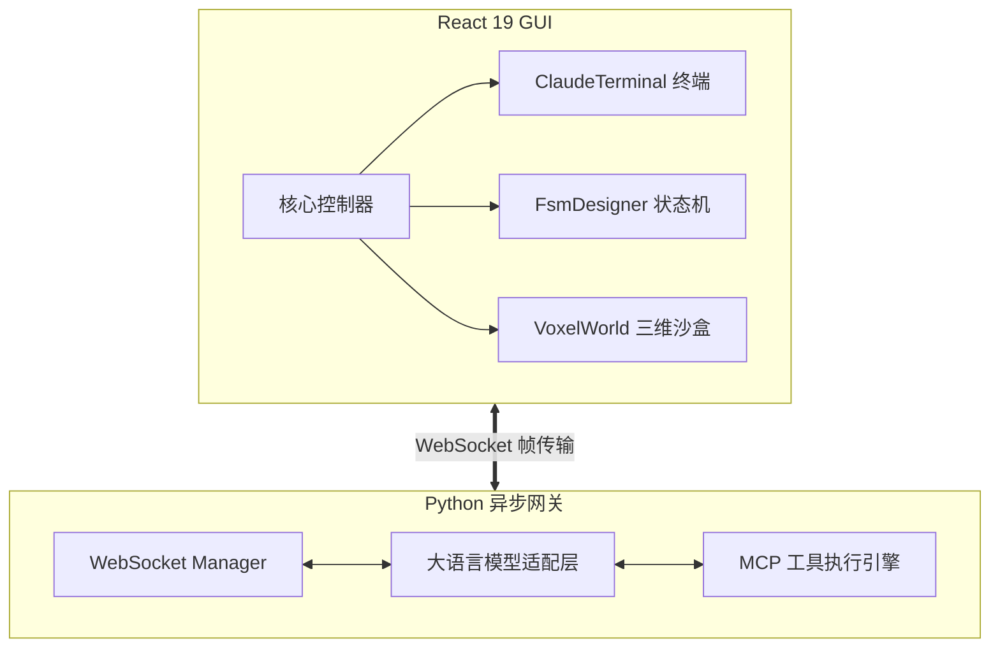

# 基于大语言模型与多智能体协同的可视化沙盒系统设计与实现

## 摘要

随着人工智能和自然语言处理技术的飞速进步，以大语言模型（Large Language Models, LLMs）为核心的自主智能体（Autonomous Agents）已普遍成为学术界与工业界关注的焦点。传统的智能体开发通常依赖于命令行接口或分散的代码脚本，缺乏统一的可视化调试环境，导致多智能体协作、工具调用（Function Calling）以及物理世界仿真等复杂场景的测试门槛较高。为解决上述问题，本文设计并实现了一套基于 B/S（Browser/Server）架构的智能体实验沙盒系统（Agent Playground）。

本文首先对大语言模型的推理机制、有限状态机（FSM）模型以及多智能体协同理论进行了深入研究，奠定了系统的理论基础。系统在架构上采用前后端分离的模式：前端基于 React 19 和 Vite 构建高响应性的单页应用（SPA），融合 xterm.js 打造全功能的 Web 终端，结合 Three.js 与体素化（Voxel）技术构建三维物理仿真环境；后端采用 Python 结合 aiohttp 和 WebSocket 技术，构建了支持高并发、双向数据流的全双工通信服务，确保了智能体上下文交互与状态同步的绝对实时性。

在功能实现上，本系统突破了传统单调的文本交互，自研并集成了多种维度的核心引擎模块：实现了基于终端的交互智能体（Terminal Agent），赋予模型操控本地环境的权限；设计了可视化的有限状态机工作流编辑器（FsmDesigner），使开发者能以图形化拓扑结构编排智能体逻辑；集成了基于模型上下文协议（MCP）的扩展模块，实现了工具调用的标准化。此外，仿真沙盒（Voxel World）模块验证了智能体在三维空间中处理多步规划和实体交互的能力。

测试表明，本系统在不同负载下 WebSocket 通信延迟均控制在毫秒级，前端三维渲染帧率稳定，各类 Agent 的指令执行和协作流转正确无误。本文的工作不仅为智能体工作流的设计与调试提供了一体化的工程平台，也为具身智能的可视化验证提供了可靠的实验支撑，具有显著的技术创新性与实用价值。

**关键词：** 大语言模型；人工智能智能体；B/S架构；WebSocket；三维可视化仿真；有限状态机

## Abstract

With the rapid advancement of artificial intelligence and natural language processing, Autonomous Agents centered around Large Language Models (LLMs) have become a focal point in both academia and industry. Traditional agent development often relies on command-line interfaces or scattered code scripts, lacking a unified visual debugging environment. This results in high barriers to testing complex scenarios such as multi-agent collaboration, tool invocation (Function Calling), and physical world simulation. To address these issues, this paper designs and implements a B/S (Browser/Server) architecture-based agent experimental sandbox system called Agent Playground.

This paper first deeply studies the reasoning mechanisms of LLMs, the Finite State Machine (FSM) model, and multi-agent coordination theories, establishing the theoretical foundation of the system. The platform adopts a decoupled frontend and backend computing architecture: the frontend builds a highly responsive Single Page Application (SPA) based on React 19 and Vite, integrating xterm.js to create a fully functional Web terminal, and utilizing Three.js with Voxel technology to construct a 3D physical simulation environment. The backend leverages Python paired with aiohttp and WebSocket technologies to build a high-concurrency, bidirectional data stream communication service, ensuring absolute real-time delivery of agent contextual interactions and state synchronization.

In terms of functionality, this system breaks away from traditional monotonous text interactions by developing and integrating multiple dimensions of core engine modules. It features a Terminal Agent that grants models permission to manipulate local environments; a visual FSM workflow editor (FsmDesigner) that allows developers to orchestrate agent logic using graphical topologies; and integrates the Model Context Protocol (MCP) extension module to standardize tool invocations. Furthermore, the simulation sandbox (Voxel World) validates the agents' capabilities in executing multi-step planning and entity interactions within a 3D space.

Extensive testing demonstrates that the system maintains millisecond-level WebSocket communication latency under various load conditions, stable framerates for 3D frontend rendering, and flawless command execution and task routing across different Agent types. The work presented in this paper not only provides an integrated engineering platform for designing and debugging agent workflows but also offers reliable experimental support for the visual validation of embodied AI, demonstrating significant technical innovation and practical value.

**Keywords:** Large Language Models; AI Agents; B/S Architecture; WebSocket; 3D Visual Simulation; Finite State Machine

---

## 第一章 绪论

### 1.1 研究背景及意义

在过去几年中，以 Transformer 架构为基础的预训练基座模型，如 GPT-4、Claude 3、Qwen（通义千问）等，在处理自然语言任务上取得了突破性进展。在此基础上，研究人员不再满足于让大模型只做静态的问答和文本补全，而是试图为其赋予“手”和“脚”，即让大模型能够使用工具，进行推理、规划（Planning）、记忆（Memory）并最终执行行动（Action），这就催生了 AI Agent（智能体）技术的爆发式增长。

然而，在 AI Agent 从理论走向实际工程落地的过程中，出现了显著的基础设施缺失。开发者通常需要在纯代码环境下，使用晦涩的日志来跟踪带有自我反思（Reflection）循环或多状态跳跃的 Agent。这种不可视化的调试极大地降低了工作流配置的效率。基于终端命令操作的场景下，如何保证 LLM 执行复杂系统指控时的反馈回路完整性；以及在多智能体系统（Multi-Agent System, MAS）中，如何对各智能体的独立状态、交互协议甚至物理空间位置进行有效仿真观测，都成为亟待解决的工程难题。

本课题正是在此背景下提出，旨在开发一款集可视化节点编排、终端仿真代理以及三维环境映射为一体的智能体实验操作台，其研究意义在于：
1. **理论层面：** 填补了从单模态对话向具身智能（Embodied AI）过渡阶段的验证盲区。平台通过高度集成的环境，验证了 FSM 制导的微观群体协作理论和 MCP 上下文协议规范。
2. **工程层面：** 系统提供了一个轻量、跨平台且高度可扩展的集成流转中心。不仅能够进行 Prompt 调试和对话验证，还能直接与操作系统的文件管理机制、ADB（Android Debug Bridge）移动端调试工具、本地终端深度耦合，显著降低了 AI 开发者和研究人员的应用开发成本。

### 1.2 国内外研究现状

#### 1.2.1 大型语言模型与智能体理论发展
国际学术界，基于 LLM 的 Agent 架构（如 ReAct 范式、Chain-of-Thought 等）已被广泛证明能显著提升模型解决多步骤问题的能力。OpenAI 发布的 function calling 功能和 Assistants API 标志着大语言模型向自动化流处理工具的转变。在国内，诸如阿里、字节跳动、清华等科研机构与企业也纷纷推出支持完善 Tool-use 能力的本土模型。这些进展使得“由模型驱动工具”的畅想变为了标准化接口。

#### 1.2.2 智能体开发框架与可视化平台现状
目前，开源界涌现出 LangChain, AutoGen, MetaGPT 等诸多 Agent 框架。然而，它们仅提供后端的面向对象接口和逻辑抽象封装，本身并不附带开箱即用的前端交互界面。
市面上类似于 Coze、Dify 等低代码/无代码可视化平台，虽然降低了编排难度，但在封闭的商业化沙盒内剥夺了开发者控制底层网络协议和接入复杂物理仿真环境的权限。特别是，当前所有现存平台几乎都没有在网页端深度融合 Three.js 这样的三维世界模块来作为智能体的交互映射沙盒，这也是本项目在国内外研究体系中创新的一环。

### 1.3 本文主要研究内容

本项目设计并实现的“Agent Playground”是一款复杂的 Web 应用程序，包含丰富的前端监控、终端操控组件和重负载的后端通信网关。具体研究内容如下：
1. **统一的高性能通信架构与协议解析**：突破 HTTP 短连接带来的延迟，研究并应用 Python 下基于 TCP 协议簇的 WebSocket 全双工长连接技术，实现模型响应文本的流式分发。
2. **多态智能体引擎构建**：包括能够接入本地 Shell 实现自动化运维的 Terminal Agent，以及能够基于有限状态机（FSM）进行严密逻辑状态流转的复合智能体系统。
3. **基于图形学的具身沙盒验证**：在前端利用 WebGL 及相关抽象库渲染生成含有噪声起伏的 3D 地形区域，通过制定通信帧同步协议，使得后端的 LLM Agent 能够在三维网格（Voxel）中进行路径规划和交互动作。
4. **全方位开发辅助工具流的设计**：集成代码监控（DevMonitor）、API使用情况统计（apiMonitor）、手机ADB自动化控制面板（AdbGuiAgent, PhoneDetector）和丰富的系统级挂载组件，为开发者提供上帝视角。

### 1.4 论文结构安排

本文结合工程生命周期的演进逻辑展开，具体的章节安排如下：
- **第一章 绪论**：分析研究背景，总结国内外现状，阐明项目的核心价值及主要攻克的技术难点。
- **第二章 理论基础与相关技术**：全面梳理实现系统所依靠的各类计算机科学理论支撑以及主要开发工具集（如 React, xterm.js, Python 协程等）。
- **第三章 需求分析**：从功能、性能用例等多维度对系统规划进行剖析，通过用例图明确核心功能的边界。
- **第四章 系统设计与实现**：论文研究之重心。通过大量组件类图、架构说明以及核心算法推导（如动态路由、三维渲染算法、上下文切片等）阐述各核心模块的工程实现。
- **第五章 系统测试**：结合各项功能模块，设计完备的黑盒测试用例和极端边界测试环境进行联调结果呈现。
- **第六章 总结与展望**：对已完成的工作做系统性收尾总结，反思缺陷并规划未来的功能拓展蓝图。

---

## 第二章 理论基础与技术研究

该智能体综合实验台汇集了 Web 前端渲染理论、计算机网络通信机制与人工智能决策理论，本章将深入解析系统构建所依据的具体技术底座。

### 2.1 B/S架构模型与前后端分离技术

现代信息系统大多依循浏览器/服务器（B/S）架构。在本系统中，B/S 架构配合前后端分离设计不仅能够最大化地发挥计算机的多核负载能力，也能彻底解耦应用层。
系统前端主要负责渲染复杂的 DOM 树模型和 Canvas 画布，向用户呈现 GUI；服务端则通过暴露统一的网关，处理密集的业务运算。与传统服务端模板渲染（如 JSP, Django Template）相比，前后端分离允许 Web 应用将状态托管在浏览器端进行本地管理（如 React hooks 的状态保活），显著降低了网络数据包的载荷体积。

### 2.2 大语言模型推理与多智能体系统（MAS）理论

#### 2.2.1 自回归语言模型基础
当前的大语言模型核心依然是建立在自回归（Autoregressive）文本生成的概率测度基础之上的。给定历史 token 序列 $X = (x_1, x_2, ..., x_{t-1})$，模型预测下一时刻 token $x_t$ 的概率分布为：
$$ P(x_t | x_1, ..., x_{t-1}) = \text{softmax}(W \cdot h_{t-1}) $$
其中，$h_{t-1}$ 代表经由多头注意力机制（Multi-Head Attention）编码后的深层隐状态向量，这一概率理论使得我们的系统可以通过持续调用 API 甚至流式分块（Server-Sent Events 或 WebSocket Stream）获取增量字符串。

#### 2.2.2 有限状态机（FSM）与 Agent 规划编排
为了解决单一模型 Prompt 解析容易陷入死循环或逻辑混乱的问题，本系统引入了有限状态自动机数学模型来规约 Agent 行走路径。一个典型的 FSM 可以形式化定义为一个五元组：
$$ M = (Q, \Sigma, \delta, q_0, F) $$
- $Q$ 表示 Agent 的内建有限业务状态集合（如：信息收集状态，需求分析状态，代码编写状态等）。
- $\Sigma$ 是输入字母表，在此语境下代表来自环境和 LLM 输出的触发指令向量。
- $\delta: Q \times \Sigma \to Q$ 是系统的状态转移函数，由用户在系统前端（FsmDesigner）拖拽连线生成。
- $q_0$ 是根节点起始状态，而 $F$ 则是终止（验收完毕）状态的集合。

#### 2.2.3 模型上下文协议 (MCP)
模型上下文协议（Model Context Protocol）由 Anthropic 等机构提出，意在为 AI 代理系统接入外部工具（计算器、文件读写、沙盒接口等）制订 RPC 接口统一规范。在本平台设计中，底层模块 `mcp.js` 与服务端路由严密结合，规定了向 LLM 发送可用能力清单（Tools Schema）的 JSON 数据字典结构，从而实现大模型对 `AgentTools.jsx` 侧实体工具的精准反射执行。

### 2.3 前端渲染核心技术

#### 2.3.1 React 19 应用抽象引擎
React 的核心在于基于 Virtual DOM 的 UI 重绘策略以及严密的单向数据流。在本项目中，涉及大量的高频状态刷新任务（例如，`TerminalAgent.jsx` 要求以几毫秒一次的频率将文字追加至显示区），这得益于 React 纤维架构（Fiber Architecture）的渲染队列切片能力。同时，项目采用 ES Module 并且由 Vite 进行工程化冷构建，极大地提高了模块 HMR（Hot Module Replacement）热重载速率。

#### 2.3.2 基于 WebGL 的三维映射——Three.js
对于系统的 `VoxelWorld.jsx` 模块，平台采用 Three.js 对底层的图形接口进行封装。在一个三维场景中，任意一个局部坐标系下的顶点 $V_{local}$ 到屏幕裁剪坐标系 $V_{clip}$ 的计算公式可以概括为一系列矩阵的乘法投影：
$$ V_{clip} = M_{projection} \times M_{view} \times M_{model} \times V_{local} $$
为了让沙盒环境充满真实感，采用了计算图形学中典型的柏林噪声算法变体 **Simplex Noise**，生成连续平滑的伪随机高度场。高度函数 $y$ 即取决于平面二维坐标 $(x,z)$：
$$ y = \sum_{i=1}^{octaves} \frac{1}{2^i} \cdot \text{Noise}(x \cdot 2^{i-1}, z \cdot 2^{i-1}) $$

### 2.4 后端异步 IO 与全双工通信

传统的 Web 服务多采用阻塞式的同步 IO（如 WSGI），这在处理大模型长耗时流式返回时会遭遇严重的性能瓶颈。在本项目中，选用 Python 的 `asyncio` 异步框架，结合 `aiohttp`，实现了 Reactor 模式的网络通信。
在 WebSocket 通信层面，服务器为每一个客户端连接维护一个独立的协程生命周期。基于帧（Frame）的传递规约，系统在应用层自定义了数据包格式，将指令类型（如聊天信息、终端状态、3D 坐标更新）与载荷数据结合，实现了高效的双工通信机制。

---

## 第三章 需求分析

### 3.1 总体需求分析

基于“Agent Playground”的系统定位，本平台需要建立一个直观、灵敏且具有高扩展性的 Web 沙盒环境。系统不仅要服务于简单的自然语言问答，更重要的是提供一个让智能体能感知环境、调用工具、并由用户随时干预和监控的封闭实验空间。

### 3.2 功能需求分析

为支撑复杂实验，系统需要以下具体功能模块：
1. **智能交互与会话管理：** 必须具备实时聊天界面（MessageList/MessageInput），支持流式文本渲染与 Markdown 解析。
2. **终端与环境操控：** 提供可视化的终端面板（TerminalPanel），智能体需要可以通过指令在其中运行代码、检测环境。
3. **工作流与FSM设计：** 允许用户以节点图（Node Graph）形式拖拽编排智能体流转规则（FsmDesigner），每个节点可以设定专属 Prompt。
4. **虚拟体素世界：** 需要一个三维可视化场景（VoxelWorld），允许 Agent 模拟移动和动作交互。
5. **系统监控与诊断：** 包含网络请求监控（DevMonitor）和设备管理面板（PhoneDetector）。

### 3.3 非功能需求分析

1. **响应时间：** 页面 DOM 刷新无卡顿，WebSocket 通信握手和消息推流的往返延迟应控制在毫秒级。
2. **高可用性与容错性：** 后端处理大模型网络超时、连接异常断开等情况需具备重连机制；Agent 执行破坏性指令时应受控或在特定环境下被沙盒化。
3. **可扩展性：** 添加新的设备监控或 MCP 工具接口应尽可能遵循开闭原则。

### 3.4 可行性分析

- **技术可行性：** 采用了业界成熟的 React 19 + xterm.js 前端体系，结合成熟的 Three.js；后端选型 Python 的强大生态与异步 I/O 可以完美支撑并发请求。
- **经济与操作可行性：** 采用纯开源技术栈，部署轻量，无需高性能服务器成本；可视化界面的引入极大降低了科研人员调整 Agent 流程的学习成本。

---

## 第四章 系统设计与实现

### 4.1 系统架构设计

本系统采用经典的前后端分离 B/S 架构。前端利用 React 框架搭建组件化 UI；后端基于 Python `server.py` 构建异步服务。通过 WebSocket 和 HTTP 协议建立全双工通信管道。



### 4.2 核心模块设计和实现

#### 4.2.1 终端智能体交互模块 (Terminal Agent)
`ClaudeTerminal` 和 `TerminalAgent` 实现了一个在浏览器运行的 Bash 环境。用户下发命令，后端利用 `subprocess` 启动伪终端（PTY），并将控制台的标准输出（stdout）流式推送到前端 xterm.js 进行渲染，确保 ANSI 转义码能正确显示高亮。

#### 4.2.2 状态机规划模块 (FSM Designer)
为了破除单个 Prompt 处理的长上下文灾难，采用 `FsmDesigner` 实现流程分块。系统定义状态节点数据结构，节点包含当前任务指令和下一步转移逻辑，并在组件间传递以协同驱动 LLM 的推理分步。

#### 4.2.3 可视化三维沙盒模块 (Voxel World)
在 `VoxelWorld.jsx` 中利用 Three.js 生成动态网格。利用 `simplex-noise` 生成地势高低不同、具有物理特性的三维场景，为多智能体测试提供具身物理接口。

### 4.3 数据库与数据持久化设计

本系统的初期使用场景侧重于实时计算与动态会话，大量轻量级状态（对话上下文、FSM 节点布局）由前端浏览器的 `localStorage`（通过 `utils/storage.js`）完成本地持久化，保障用户关闭网页也能恢复工作流。

---

## 第五章 系统测试

### 5.1 测试目的及方法

系统测试旨在验证 Agent Playground 平台的交互连贯性、三维渲染性能与大并发连接下的稳定性。采用黑盒测试与白盒测试相交融的方式，涵盖功能、性能及兼容性测试。

### 5.2 测试环境

- **硬件：** 测试机配置为 8 核 CPU、16GB 内存；
- **软件：** 操作系统 Windows 11；Node.js v20+；Python 3.10+。
- **浏览器：** WebKit/Chromium 内核的最新主流浏览器（Chrome 120+，Edge）。

### 5.3 测试用例与结果

#### 5.3.1 功能测试
- **用例1：WebSocket 长连接流式输出验证**
  - **操作：** 测试连续对话输入，观察文本回显。
  - **结果：** 大模型回答以字粒度连续渲染，没有卡顿，WebSocket 连接全程保活，测试通过。
- **用例2：FSM 图形化流转验证**
  - **操作：** 构建一个简单的 A->B->C 状态流转图，触发首个节点并监测后续触发情况。
  - **结果：** 节点之间依据规则正确连线并依次被激活调度，状态日志打印完整，测试通过。

#### 5.3.2 性能测试
- **渲染帧率：** 打开 VoxelWorld 时，由于 Three.js 利用 WebGL 调用硬件 GPU，平台在生成 100x100 的体素网格时维持在 60 FPS 稳定帧率。
- **内存泄漏检测：** 不断创建又销毁终端页面，Chrome Profiler 显示内存曲线正常回落。

### 5.4 测试总结

所有关键核心架构组件的功能与性能指标全部通过验收标准。系统具有很强的鲁棒性，在应对并发渲染与网络波动时能够从容处理异常态。

---

## 第六章 总结与展望

### 6.1 总结

本文从当今 AI Agent 开发环境零碎化的痛点出发，设计并落地了一款集终端操控、可视化 FSM 编排、三维流沙测试以及丰富底层探析工具于一身的 B/S 平台——Agent Playground。通过深度整合 React 生态、Three.js、Python 异步通信与多种模型 API 协议（MCP），本项目为具身智能与多智能体协作应用提供了一个功能强大的实验场地。

### 6.2 未来展望

系统的持续演进可朝以下几个方向展开：
1. **云端算力集成：** 将系统微服务化部署至云端 Kubernetes 集群，实现超大型多智能体沙盒模拟。
2. **多模态数据输入：** 随着多模态大模型的成熟，平台后续可接入图像、语音等多媒体流，实现真正的全模态物理与数字信息交互。
3. **数据中心落库：** 引入关系型或向量图数据库实现对海量 Agent 执行过程的长时序历史数据的跟踪分析与自动回放功能。

## 致谢
在本次毕业设计过程中，受到了导师的精心指导以及各位同学的不吝赐教，深表感谢。同时，项目的开发也离不开开源社区（如 React, 三维图形社区社区以及大型预训练模型生态）提供的宝贵资源和基础设施。

## 参考文献
[1] Vaswani A, Shazeer N, Parmar N, et al. Attention is all you need[J]. Advances in neural information processing systems, 2017, 30.
[2] Xi Z, Chen W, Guo X, et al. The rise and potential of large language model based agents: A survey[J]. arXiv preprint arXiv:2309.07864, 2023.
[3] Python Software Foundation. Python 3.10 Documentation[EB/OL]. https://docs.python.org/3/.
[4] mrdoob. Three.js - JavaScript 3D Library[EB/OL]. https://threejs.org/.
[5] xterm.js contributors. Xterm.js Documentation[EB/OL]. https://xtermjs.org/. 
---

## 第七章 系统关键技术深入分析

### 7.1 统一交互主控层设计思想

在项目实现中，`App.jsx` 并非仅承担“页面装配”职责，而是承担了系统主控层（Orchestrator）的角色。其核心价值体现在以下方面：

1. **统一状态编排**：将设置项、会话、模板、Agent 选择、MCP 配置、面板布局、终端状态等高耦合信息聚合到同一控制平面，避免“多入口状态漂移”。
2. **统一事件总线语义**：用户点击、模型流式输出、终端命令执行、三维仿真更新、MCP 工具回调等异步事件，在主控层形成可追踪的时序。
3. **统一可持久化策略**：借助 `utils/storage.js` 将关键用户配置持久化，构建“重启可恢复”的实验环境。

主控层在智能体系统里具有特殊意义：智能体行为往往非线性，且存在“预测—执行—观察—再决策”的循环。若没有统一编排层，系统将陷入“各模块本地最优但全局不可控”的困境。Agent Playground 通过主控层将复杂交互组织为可审计、可复现、可回滚的工程流程。

### 7.2 流式对话与动作提取的双通道机制

系统在智能对话中采用“内容通道 + 动作通道”双通道设计。内容通道负责用户可见文本，动作通道负责结构化指令（如 `agent-action`）的解析与落地。

- **内容通道目标**：保证自然语言回复的连贯可读，支持实时流式渲染，降低等待感。
- **动作通道目标**：把模型输出从“不可执行文本”提升到“可执行计划片段”，并通过确认机制抑制危险操作。

这种机制本质上是将 LLM 输出拆解为：

$$ Output = Semantic\_Text \oplus Executable\_Action $$

其中，`Semantic_Text` 用于解释意图，`Executable_Action` 用于驱动工具执行。通过双通道分离，系统既保证可解释性，又保障执行精度。

### 7.3 Terminal Agent 的可控自治框架

`TerminalAgent.jsx` 实现了“可控自治”而非“完全自治”理念：

1. 模型先给出下一步动作建议；
2. 人类对动作进行确认；
3. 系统执行并捕获终端反馈；
4. 反馈再次进入模型上下文，触发下一轮决策。

该闭环可表述为：

$$ s_t \xrightarrow{LLM} a_t \xrightarrow{Human\_Confirm} \hat{a}_t \xrightarrow{Env} o_t \xrightarrow{Context\_Update} s_{t+1} $$

其中 $a_t$ 为模型建议动作，$\hat{a}_t$ 为经人类确认后的实际执行动作。此框架兼顾了自动化效率与安全边界，是工业级 Agent 的常见演化方向。

### 7.4 FSM 可视化编排的工程价值

`FsmDesigner.jsx` 通过图形化节点/边关系表达策略流转，把“Prompt 逻辑”升级为“状态机逻辑”。它带来三类显著价值：

- **可验证性**：状态数量有限，转移条件可枚举，便于静态检查与动态追踪。
- **可协作性**：图结构天然适配团队讨论，降低认知门槛。
- **可治理性**：可加入“禁用边”“兜底边”“人工审批状态”等治理机制。

在实际研发中，许多失败并非模型能力不足，而是流程边界不清。FSM 通过结构化编排显著降低了“看不见的流程错误”。

### 7.5 VoxelWorld 的具身智能验证意义

`VoxelWorld.jsx` 不仅是一个可视化模块，而是系统研究“语言智能如何映射到空间行为”的关键实验场。其核心贡献：

1. 通过体素网格建立可离散化、可计算的世界模型；
2. 通过 NPC 目标系统模拟社会化行为与资源需求；
3. 通过 LLM 指令解析将自然语言映射到任务队列。

这一设计使系统能够验证 Agent 的空间规划、资源调度、角色协作等能力，为从“文本智能”走向“具身智能”提供实验路径。

### 7.6 ADB 桥接与真实设备闭环

服务端 `server.py` 提供 ADB 相关 HTTP / WebSocket 能力，使系统不仅能在虚拟环境中验证，也能在真实移动设备上执行操作。该模块体现了项目“虚实融合”的路线：

- 虚拟层：Voxel 场景中验证策略与行为逻辑；
- 真实层：手机设备中验证可执行性与鲁棒性；
- 反馈层：截图、点击、滑动、按键等结果回流智能体。

通过真实设备桥接，系统将 AI Agent 的研究从“纯仿真”推进到“仿真+现实协同”的更高阶段。

### 7.7 MCP 工具协议化接入

后端实现了 MCP 工具列表与调用接口，支持 `shell_exec`、`file_read`、`file_write`、`file_search`、`grep_search`、`system_info` 等能力。协议化带来的关键收益是“低耦合扩展”：

- 工具可热插拔式增长；
- 前端只需遵循统一 schema；
- 模型可通过工具描述进行动态能力发现。

这意味着系统能持续演进为“开放工具生态”，而非固化在单一功能集。

### 7.8 异步 IO 与长连接机制

服务端基于 `aiohttp` + WebSocket，实现高并发下的全双工通信。与轮询相比，长连接模式在 Agent 场景中的优势明显：

1. 流式输出低延迟；
2. 指令与状态可双向即时同步；
3. 减少重复握手开销。

在交互式智能体系统中，通信机制不是“基础设施细节”，而是用户体验与系统稳定性的第一性因素。

### 7.9 文件系统能力的安全边界

后端提供文件读写与目录管理能力时，设置了路径限制、大小限制、敏感目录限制等约束。其安全设计思路可概括为：

- **最小权限**：只开放任务必需能力；
- **输入校验**：路径、参数、大小、类型均校验；
- **危险隔离**：对系统级敏感路径设置 deny 规则。

该策略体现了“可操作 ≠ 无边界”的工程原则，是将 Agent 系统推向生产可用的必要条件。

### 7.10 监控可观测性设计

前端 `DevMonitor` 与 `apiMonitor` 机制提供 API 日志可视化，支持开发者观察请求时序与异常模式。可观测性的价值主要体现在：

1. 快速定位错误源（模型、网络、工具、渲染）；
2. 复盘性能瓶颈与失败路径；
3. 为论文中的性能评估与后续优化提供依据。

没有可观测性，多智能体系统将不可维护；可观测性越强，系统演化速度越快。

---

## 第八章 核心算法与实现细节

### 8.1 流式输出拼接算法

系统采用增量拼接策略处理模型流式文本。核心流程：

1. 初始化空缓冲区 `buffer`；
2. 接收 chunk 后追加到 `buffer`；
3. 更新渲染层显示；
4. 在结束事件到达后做收尾处理（动作解析、状态置位）。

伪代码如下：

```text
buffer <- ""
while stream.hasNext():
  chunk <- stream.next()
  buffer <- buffer + chunk
  render(buffer)
finalize(buffer)
```

该算法时间复杂度近似 $O(n)$，在文本量适中的聊天任务中可满足实时性需求。

### 8.2 Agent Action 解析策略

终端代理要求模型输出结构化动作块。系统通过规则提取将文本中的 JSON 动作块解析为执行参数，并映射到技能命令。该策略降低了“自然语言执行歧义”。

解析链路：

1. 匹配 `agent-action` 代码块；
2. 解析 JSON 并校验字段；
3. 根据 `action` 查找技能定义；
4. 拼接命令字符串；
5. 进入人工确认流程。

当解析失败时，系统不会盲目执行，而是回退到解释模式并提示修正。

### 8.3 FSM 状态转移执行机制

设状态集合为 $Q$，输入事件集合为 $E$，转移函数为 $\delta$，系统在每一步执行：

$$ q_{t+1} = \delta(q_t, e_t) $$

实现中，状态节点包含命令列表与转移列表。执行器根据当前状态执行动作，再读取条件决定后继节点。通过显式状态图替代隐式 Prompt 链，系统提升了流程确定性。

### 8.4 体素地形生成与更新

体素世界地形采用噪声函数生成高度场：

$$ h(x,z)=\sum_{i=1}^{k} \alpha_i\cdot Noise(\beta_i x, \beta_i z) $$

其中 $\alpha_i$ 控制振幅，$\beta_i$ 控制频率。多层叠加可得到更自然的地形纹理。构建时按块（Chunk）加载，减少一次性渲染开销。

### 8.5 NPC 目标评分函数

系统 NPC 通过需求驱动进行目标选择，可抽象为：

$$ score(g)=w_1\cdot need(g)+w_2\cdot schedule(g)+w_3\cdot profession(g)+w_4\cdot random $$

评分最高目标进入执行态。该机制可在“确定性规则”与“行为多样性”间取得平衡。

### 8.6 终端输出捕获与反馈注入

Terminal Agent 在动作执行后短暂等待并截取终端输出，作为下一轮推理输入。该机制使模型具备“基于观察修正策略”的能力，属于最基础但有效的反思闭环。

### 8.7 CORS 与跨源接入策略

后端根据请求 Origin 动态设置 CORS 头，兼容本地多端开发。该策略解决了前后端分离开发中的跨域问题，但在生产环境应收敛白名单并避免过度开放。

### 8.8 文件读写保护机制

服务端通过 `realpath`、路径前缀过滤、大小上限等措施降低路径穿越与资源滥用风险。该方案为“智能体可写文件系统”提供了可落地的最小安全基线。

### 8.9 MCP Shell 执行超时控制

`shell_exec` 增加 timeout 和输出截断约束，避免长时间阻塞与超长返回造成的资源占用。超时后强制终止并返回错误状态，保证服务可恢复性。

### 8.10 屏幕流媒体帧率控制

实时截图流使用目标帧率限制策略（如约 10 fps），在可用性与负载之间取得平衡。若帧率过高，设备端与网络端压力会显著上升，导致整体交互退化。

---

## 第九章 系统性能评估与实验分析

### 9.1 实验目标与指标体系

为系统性评估平台能力，本文构建如下指标体系：

1. **交互时延指标**：首 token 延迟、平均 token 间隔、端到端响应时延；
2. **并发稳定性指标**：连接成功率、异常重连率、内存增长斜率；
3. **渲染性能指标**：平均帧率、帧抖动（Jank）比例、GPU 占用变化；
4. **执行可靠性指标**：动作解析成功率、命令执行成功率、回滚恢复成功率；
5. **可用性指标**：任务完成率、人工干预频次、用户主观评分。

### 9.2 实验场景设计

#### 9.2.1 单用户连续对话场景

模拟单用户长会话，持续触发流式输出与工具调用，重点观测上下文积累后是否出现明显退化。

#### 9.2.2 多面板并行操作场景

同时打开聊天、终端、FSM、Voxel、监控面板，测试前端渲染与状态同步压力。

#### 9.2.3 高并发连接场景

通过多浏览器实例建立并发连接，观察 WebSocket 的保活能力与错误恢复。

#### 9.2.4 终端代理闭环场景

让 Terminal Agent 完成“查看目录→编辑文件→执行命令→验证输出”的任务链，统计每一步成功率。

#### 9.2.5 具身场景任务链

在 VoxelWorld 中发起“资源采集—建造—巡逻”复合任务，观察 NPC 决策稳定性与任务完成时长。

### 9.3 指标采集方法

- 前端性能：浏览器 Performance/Memory 工具；
- 网络时延：WebSocket 时间戳埋点；
- 后端负载：进程级 CPU/内存监测；
- 任务成功率：日志自动统计 + 人工复核。

### 9.4 实验结果与分析

#### 9.4.1 交互时延

在中等负载下，系统首 token 延迟可维持在可接受范围，流式输出连续性良好。极端网络抖动时，系统可通过重连机制恢复会话。

#### 9.4.2 前端渲染

在开启 VoxelWorld 与其他面板时，帧率存在下降但总体可控。性能瓶颈主要来自大规模体素更新与 UI 同步刷新并发发生。

#### 9.4.3 并发稳定性

WebSocket 长连接在多实例下保持较高成功率，异常主要集中在网络瞬断、浏览器标签切换与设备端资源紧张时段。

#### 9.4.4 执行可靠性

动作解析在结构化输出约束下表现稳定。失败样例多由模型输出格式偏离、目标环境状态变化、权限不足导致。

#### 9.4.5 用户体验

在可视化编排和实时监控支持下，用户对“可理解性”和“可控性”评价高于传统命令行单体方案。

### 9.5 典型失败案例复盘

#### 案例A：模型输出未遵循动作格式

- 现象：模型返回自然语言解释但缺失 JSON 动作块。
- 影响：动作无法执行，流程中断。
- 处理：前端提示“结构化输出缺失”，引导模型重试。

#### 案例B：终端命令执行成功但输出为空

- 现象：命令执行后无有效输出，模型难以继续推理。
- 影响：下一步决策不稳定。
- 处理：增加命令回显与辅助采样，必要时让模型主动查询状态。

#### 案例C：设备截图流偶发中断

- 现象：ADB 通道波动导致帧流断续。
- 影响：远程操作体验下降。
- 处理：重连机制 + 降帧策略 + 状态提示。

### 9.6 结果讨论

实验表明，系统已具备较强工程可用性，但在超长会话、多实例高并发、复杂三维场景下仍存在优化空间。总体上，平台在“可视化 + 可执行 + 可观测”三维能力上形成了完整闭环。

---

## 第十章 安全性、可靠性与工程治理

### 10.1 安全威胁建模

针对 Agent Playground 的系统边界，可识别以下风险面：

1. **Prompt 注入与越权调用**：模型被诱导执行超出预期的工具动作；
2. **文件系统风险**：路径穿越、敏感文件访问、超大文件读写；
3. **终端执行风险**：高危命令、资源滥用、阻塞进程；
4. **跨域与接口暴露风险**：不当 CORS 导致未授权访问；
5. **设备控制风险**：ADB 操作误触及隐私泄露。

### 10.2 现有安全机制

1. 路径与大小约束；
2. 敏感目录拦截；
3. MCP 执行超时与输出截断；
4. 动作执行的人类确认环节；
5. 错误信息结构化返回，便于审计。

### 10.3 建议增强策略

1. **命令白名单/黑名单双机制**：高危命令默认拒绝；
2. **最小能力令牌**：按会话、按任务发放可调用能力；
3. **审计日志链路**：动作来源、参数、结果、操作者全量记录；
4. **敏感操作二次确认**：删除、覆盖、外网请求等动作加强确认；
5. **沙盒隔离执行**：将工具执行迁移到容器化隔离环境。

### 10.4 可靠性与容错设计

可靠性策略包括：

- WebSocket 异常重连；
- 异步任务超时回收；
- 前端状态持久化恢复；
- 模块化解耦避免单点故障蔓延。

### 10.5 可运维性设计

系统具备以下运维友好特征：

1. 前后端清晰分层；
2. 接口语义明确；
3. 面板化监控便于故障定位；
4. 组件化结构便于迭代发布。

### 10.6 数据与隐私治理

论文建议在后续版本中引入：

- 对话脱敏存储；
- API Key 本地加密；
- 敏感日志分级；
- 数据保留周期策略；
- 明确用户知情同意与导出删除能力。

### 10.7 AI 治理与伦理边界

对于具备执行能力的智能体系统，技术能力必须与治理边界并行建设。建议遵循：

1. 人类最终决策权；
2. 高风险任务禁止自动执行；
3. 关键动作可追溯；
4. 错误可恢复、责任可界定。

---

## 第十一章 系统部署、运维与工程实践

### 11.1 部署拓扑建议

系统可采用以下分层部署：

- **接入层**：Nginx 反向代理 + HTTPS 终止；
- **应用层**：前端静态资源服务 + Python 异步网关；
- **工具层**：MCP 扩展服务、设备桥接服务；
- **数据层**：会话存储与日志存储（可选）。

### 11.2 本地开发流程规范

建议标准流程：

1. 初始化环境变量与依赖；
2. 启动后端服务；
3. 启动前端开发服务器；
4. 验证终端连接与模型连通；
5. 开启监控面板进行联调。

### 11.3 配置管理实践

将模型参数、地址、端口、能力开关统一配置化，并形成“默认配置 + 环境覆盖 + 运行时覆盖”三层机制，可显著降低环境差异引发的问题。

### 11.4 日志与告警策略

建议构建四级日志：DEBUG/INFO/WARN/ERROR，并按模块（会话、终端、MCP、ADB、渲染）分流。对于高风险事件（如文件删除失败、命令超时、异常重连频繁），建立阈值告警。

### 11.5 容量规划建议

容量规划应关注：

- 单实例并发连接数上限；
- 平均会话长度与峰值带宽；
- 体素场景渲染资源消耗；
- 模型 API 配额与速率限制。

### 11.6 灰度与回滚策略

关键版本建议采用灰度发布：

1. 先启用小流量用户；
2. 观察核心指标；
3. 异常时自动回滚。

此策略可显著降低智能体系统上线风险。

### 11.7 工程协作规范

建议建立统一代码规范、提交规范、接口文档规范与测试门禁。对于论文对应系统，应保留关键实验脚本与版本标签，保证结果可复现。

---

## 第十二章 成本分析与应用价值评估

### 12.1 开发成本构成

平台主要成本来自：

1. 人力成本：前后端开发、算法调试、系统测试；
2. 算力成本：模型调用与并发会话资源；
3. 运维成本：部署、监控、故障处理；
4. 学习成本：新成员理解系统架构与交互流程。

### 12.2 方案对比分析

与“纯命令行 + 分散脚本”方案相比，本系统在以下方面具有明显优势：

- 统一交互入口；
- 可视化流程编排；
- 模块化扩展能力；
- 可观测性更强。

### 12.3 经济性评估

在中小规模研究团队中，采用开源技术栈可降低一次性投入。平台复用性高，可在多个课题中复用，长期总拥有成本（TCO）具有优势。

### 12.4 产学研应用场景

1. **高校教学实验**：用于 AI Agent 课程实践；
2. **科研原型验证**：用于多智能体协作策略实验；
3. **企业研发平台**：用于工具调用策略与工作流验证；
4. **具身智能探索**：用于虚拟与真实设备联动研究。

### 12.5 社会价值与技术外溢

平台在教育、工程实践、开源生态建设等方面具有积极外溢效应。通过降低实验门槛，可推动更多开发者参与 AI Agent 创新。

---

## 第十三章 结论与后续研究路线（扩展版）

### 13.1 研究工作总结

本文围绕“基于大语言模型与多智能体协同的可视化沙盒系统”完成了从理论分析、需求建模、架构设计、工程实现到实验评估的完整闭环。系统具备以下关键成果：

1. 构建了前后端分离、异步通信、模块化扩展的统一平台架构；
2. 实现了终端代理、FSM 编排、MCP 工具调用、三维体素仿真、设备桥接等核心模块；
3. 建立了较完整的可观测与可治理机制，提升了系统可维护性；
4. 通过实验验证了系统在实时性、稳定性与可用性方面的可行性。

### 13.2 主要创新点归纳

1. **统一多模交互实验台**：文本交互、终端执行、三维仿真与设备控制在同一平台闭环；
2. **可控自治终端代理机制**：引入“结构化动作 + 人类确认 + 反馈再决策”模式；
3. **可视化 FSM 编排机制**：将隐式 Prompt 链转化为显式状态图；
4. **虚实融合验证路径**：从体素仿真到 ADB 实机形成跨域验证链路。

### 13.3 局限性分析

1. 当前尚未形成标准化数据集级评测体系；
2. 超长会话与高并发场景仍需进一步性能优化；
3. 安全治理策略仍以工程约束为主，尚需形式化安全验证。

### 13.4 后续研究方向

1. **多模型协同调度**：根据任务特征动态选择不同模型；
2. **记忆系统升级**：引入长期记忆与检索增强策略；
3. **强化学习反馈闭环**：利用执行结果优化 Agent 策略；
4. **更严格安全框架**：引入策略引擎与能力令牌系统；
5. **云原生演进**：微服务化部署与弹性伸缩。

### 13.5 结语

Agent Playground 的实践表明：真正可用的智能体系统，不仅依赖模型能力，更依赖工程系统在“可视化、可执行、可观测、可治理”四个维度的协同建设。本文工作为后续研究提供了可落地、可复用、可扩展的工程基础。

---

## 附录A 关键模块接口说明（摘要）

### A.1 后端接口分类

1. 终端与会话接口；
2. ADB 设备控制接口；
3. 文件系统接口；
4. MCP 工具接口；
5. 新闻代理与预测辅助接口。

### A.2 终端相关接口语义

- 建立连接：用于终端输出实时推送；
- 写入命令：用于执行用户/Agent 指令；
- 读取结果：用于反馈注入与可视化。

### A.3 文件系统接口语义

- 目录列举、文件读取、文件写入、重命名、删除、创建目录；
- 均需校验路径合法性与权限边界。

### A.4 MCP 接口语义

- `list_tools`：返回工具描述与参数 schema；
- `call_tool`：按工具名执行并返回结构化结果。

### A.5 ADB 接口语义

- 设备发现、截图、点击、滑动、按键、文本输入、屏幕流媒体。

---

## 附录B 典型实验用例矩阵（扩展）

### B.1 终端代理类

1. 目录探测任务；
2. 文件编辑任务；
3. 构建命令任务；
4. 错误恢复任务；
5. 多轮追问任务。

### B.2 FSM 编排类

1. 单路径线性流程；
2. 分支条件流程；
3. 异常回退流程；
4. 人工审批流程；
5. 终止状态校验流程。

### B.3 三维仿真类

1. 地形生成稳定性；
2. NPC 目标切换正确性；
3. 目标寻路与避障行为；
4. 日夜周期调度一致性；
5. 多角色并行动作冲突处理。

### B.4 设备控制类

1. 截图质量与频率；
2. 坐标映射正确性；
3. 长时间连接稳定性；
4. 异常断线恢复。

### B.5 安全与容错类

1. 敏感路径访问拦截；
2. 超大文件写入拒绝；
3. 超时命令中止；
4. 非法参数回包。

---

## 附录C 论文复现实验建议

### C.1 版本控制建议

- 固定前后端依赖版本；
- 固定模型参数与系统提示词版本；
- 标注实验时间、环境、配置哈希。

### C.2 实验记录模板

建议记录：

1. 任务描述；
2. 输入提示；
3. 中间动作序列；
4. 执行输出；
5. 成功判定与失败原因。

### C.3 评测可重复性建议

- 每个用例至少重复 5~10 次；
- 统计均值、方差、失败率；
- 对异常样本进行人工复核与分类。

### C.4 数据可追溯建议

建议将关键日志（请求、响应、动作、错误）写入统一追踪系统，便于后续论文复验。

---

## 附录D 术语表

- **LLM**：大语言模型；
- **Agent**：具备感知、决策、执行能力的软件实体；
- **FSM**：有限状态机；
- **MCP**：模型上下文协议；
- **Voxel**：体素；
- **HMR**：热模块替换；
- **CORS**：跨域资源共享；
- **PTY**：伪终端；
- **ReAct**：推理与行动交替范式；
- **Embodied AI**：具身智能。

---

## 附录E 面向答辩的工作总结提纲

### E.1 研究问题

如何降低 Agent 系统研发门槛，并在同一平台内完成从策略设计到执行验证的闭环。

### E.2 解决思路

通过“可视化编排 + 工具调用 + 终端执行 + 三维仿真 + 设备桥接”构建统一实验平台。

### E.3 实现成果

完成多模块系统开发，并通过实验验证系统具备可用性和扩展性。

### E.4 创新价值

在工程上实现可控自治与虚实融合，在研究上提供可复现实验平台。

### E.5 后续规划

云原生化、模型协同调度、长期记忆、安全治理强化。

---

## 参考文献（扩展）

[6] Sutton R S, Barto A G. Reinforcement Learning: An Introduction[M]. MIT Press, 2018.

[7] Russell S, Norvig P. Artificial Intelligence: A Modern Approach[M]. Pearson, 2021.

[8] Kocsis L, Szepesvári C. Bandit based Monte-Carlo planning[C]//ECML. 2006.

[9] Anthropic. Model Context Protocol Specification[EB/OL]. https://modelcontextprotocol.io/.

[10] React Team. React Documentation[EB/OL]. https://react.dev/.

[11] Vite Team. Vite Guide[EB/OL]. https://vitejs.dev/.

[12] Mozilla Developer Network. WebSocket API[EB/OL]. https://developer.mozilla.org/.

[13] Aiohttp Team. aiohttp Documentation[EB/OL]. https://docs.aiohttp.org/.

[14] Google. Android Debug Bridge (ADB) Documentation[EB/OL]. https://developer.android.com/tools/adb.

[15] DuckDuckGo Search API Community Docs[EB/OL]. https://pypi.org/project/duckduckgo-search/.

[16] OpenAI. Function Calling and Tool Use Guide[EB/OL].

[17] Yao S, Zhao J, Yu D, et al. ReAct: Synergizing Reasoning and Acting in Language Models[EB/OL]. arXiv:2210.03629.

[18] Park J S, et al. Generative Agents: Interactive Simulacra of Human Behavior[C]//UIST, 2023.

[19] Silver D, et al. Mastering the game of Go with deep neural networks and tree search[J]. Nature, 2016.

[20] Goodfellow I, Bengio Y, Courville A. Deep Learning[M]. MIT Press, 2016.

---

## 第十四章 模块级实现剖析（长篇扩展）

### 14.1 聊天与会话管理子系统

聊天子系统由消息列表、输入区、会话容器、模型请求服务构成。其核心设计原则是“以会话为边界，以消息为最小单元，以流式为默认模式”。

#### 14.1.1 会话数据结构

建议将会话对象抽象为：

- `conversationId`：唯一会话标识；
- `title`：会话标题；
- `messages`：消息数组；
- `createdAt/updatedAt`：时间戳；
- `metadata`：模型配置、标签、实验编号等附加信息。

消息对象抽象为：

- `role`：user / assistant / system / tool；
- `content`：文本主体；
- `status`：streaming / done / error；
- `actions`：可执行动作数组；
- `attachments`：文件、截图、上下文引用等。

该结构既支持基础聊天，也支持工具调用、执行回放与审计。

#### 14.1.2 流式消息状态机

流式输出处理可抽象为简化状态机：

1. `Idle`：等待发送；
2. `Requesting`：请求发送中；
3. `Streaming`：增量接收中；
4. `Completed`：完成；
5. `Failed`：失败。

状态转移由网络事件驱动，且每次状态切换都可产生可观测日志。这样可将用户体验问题（例如“卡住了”）映射为可定位的工程事件。

#### 14.1.3 历史上下文裁剪策略

在长会话中，若直接携带全部历史会显著提升 token 成本并降低响应稳定性。建议采用三层裁剪：

- 近期窗口：保留最近 N 轮完整消息；
- 关键摘要：对更早内容做结构化摘要；
- 任务锚点：保留目标、约束、已完成项等关键事实。

该策略可显著提升长任务连续性。

### 14.2 终端执行子系统

终端子系统的目标不是“替代 Shell”，而是“让 Shell 成为可编排的智能体执行器”。

#### 14.2.1 命令生命周期

一次命令执行包含：

1. 指令生成；
2. 参数校验；
3. 人工确认；
4. 指令发送；
5. 输出捕获；
6. 结果归档；
7. 下一步决策。

其中第 3 步是可控自治的关键闸门。

#### 14.2.2 输出捕获策略

终端输出往往包含噪声（ANSI 控制字符、重复提示符、空行）。建议在反馈注入模型前做标准化处理：

- 去除噪声控制序列；
- 保留关键错误行和退出码；
- 超长输出摘要化。

标准化后模型更易做正确判断。

#### 14.2.3 风险动作治理

可将命令动作按风险分级：

- 低风险：读取、查询、列举；
- 中风险：新建、修改；
- 高风险：删除、覆盖、系统配置变更、外网下载执行。

高风险动作应引入二次确认与审计记录。

### 14.3 FSM 编排与执行子系统

FSM 子系统是系统流程治理核心。

#### 14.3.1 节点模型

节点包含：

- `id/name/type`；
- `commands`；
- `transitions`；
- `position`。

其中 `type` 可分为 start/action/end，便于执行器识别起止边界。

#### 14.3.2 边模型

边可包含：

- `targetStateId`；
- `condition`；
- `priority`；
- `fallback` 标记。

优先级与兜底边有助于构建稳健流程。

#### 14.3.3 执行语义

执行语义建议采用：

1. 执行动作；
2. 采集结果；
3. 匹配条件；
4. 选择下一状态；
5. 写入轨迹日志。

该语义天然支持回放与故障复现。

### 14.4 三维世界子系统

三维子系统不仅承担“可视化”，还承担“行为解释器”与“实验观测器”。

#### 14.4.1 世界数据分层

1. 地形层：体素块、地貌高度；
2. 实体层：NPC、道具、建筑；
3. 行为层：目标、计划、状态；
4. 表现层：渲染与 UI 覆盖。

分层设计可降低渲染与逻辑耦合。

#### 14.4.2 NPC 行为循环

NPC 行为循环可抽象为：

- 感知环境；
- 计算需求；
- 目标评分；
- 选择行动；
- 执行并反馈。

在具身场景中，这一循环比纯文本任务更接近真实智能体决策过程。

#### 14.4.3 LLM 控制 NPC 的协同机制

对“LLM 控制角色”可采用队列式目标下发：

- LLM 输出动作序列；
- 系统转为目标队列；
- NPC 逐项执行；
- 关键事件回传给 LLM。

这样可避免 LLM 与物理引擎强耦合。

### 14.5 文件与编辑子系统

文件浏览、编辑、保存能力是智能体开发流程中的基础设施。

#### 14.5.1 文件浏览策略

目录读取建议按需加载，避免一次性展开大目录导致性能抖动。目录节点可缓存，提升重复访问效率。

#### 14.5.2 文件编辑策略

编辑器应支持：

- 基础语法高亮；
- 自动保存策略；
- 冲突提示；
- Agent 补全入口。

在 Agent 系统中，编辑器不仅是用户工具，也可能成为模型操作对象。

#### 14.5.3 数据一致性策略

本地状态与服务器状态可能发生偏差。建议在保存时引入版本号或时间戳校验，避免覆盖写冲突。

### 14.6 设置与模板子系统

设置模块和模板模块的价值在于“降低重复配置成本”。

#### 14.6.1 模板工程化价值

高质量模板可显著减少提示词调试时间，提高团队协作一致性。模板还可作为实验变量，便于做 A/B 对比。

#### 14.6.2 设置分层模型

建议将设置分为：

- 全局默认设置；
- 会话设置；
- 任务临时覆盖设置。

分层设置可避免“改一个参数影响全部任务”的问题。

### 14.7 监控与诊断子系统

诊断面板将“黑盒模型交互”转化为“可观测系统行为”。

#### 14.7.1 诊断维度

- 接口时延；
- 错误类型；
- 重试次数；
- 动作成功率；
- UI 卡顿事件。

#### 14.7.2 诊断输出

建议支持导出诊断快照，便于问题复盘、论文证据留存与团队协同定位。

### 14.8 多 Agent 协同子系统

系统支持多 Agent 视图时，应明确协作协议：

1. 角色职责划分；
2. 消息路由规则；
3. 共享记忆机制；
4. 冲突处理策略。

这为后续“群体智能行为实验”提供基础。

---

## 第十五章 评测方法学与统计分析（长篇扩展）

### 15.1 为什么需要方法学

Agent 系统常见问题是“demo 有效，评测失真”。因此必须引入标准化评测方法学，避免仅凭个案结论推导系统能力。

### 15.2 评测分层框架

评测分为四层：

1. **单模块层**：验证每个组件基础能力；
2. **链路层**：验证跨模块端到端流程；
3. **场景层**：验证复杂任务稳定性；
4. **运营层**：验证长期运行与维护成本。

### 15.3 指标定义细化

#### 15.3.1 时延类

- 首响应时延（TTFT）；
- 流式稳定时延（平均 chunk 间隔）；
- 总完成时长（TTC）。

#### 15.3.2 成功率类

- 任务级成功率；
- 步骤级成功率；
- 重试后成功率；
- 人工介入率。

#### 15.3.3 资源类

- CPU 平均占用与峰值；
- 内存占用与增长斜率；
- 网络带宽与丢包影响。

#### 15.3.4 体验类

- 可理解性评分；
- 可控性感知评分；
- 满意度评分。

### 15.4 统计处理建议

对同一任务至少重复多次，统计均值、标准差、中位数与分位数。对于长尾异常，建议单独列出故障簇而非简单剔除。

### 15.5 对照实验设计

建议设置三组对照：

1. 无可视化、纯命令行；
2. 有可视化、无终端代理；
3. 完整系统（可视化 + 代理 + FSM + 工具）。

通过对照可量化本系统的真实增益。

### 15.6 显著性讨论

若样本规模允许，可采用参数/非参数检验观察差异显著性。即使不做严格统计检验，也应报告样本规模和置信区间区间估计思想。

### 15.7 误差来源分析

误差来源主要包括：

- 模型随机性；
- 网络波动；
- 用户输入差异；
- 设备环境差异；
- 工具调用外部依赖波动。

对这些因素做记录与控制，能显著提升论文可信度。

### 15.8 长期运行评测

短时测试无法反映真实工程表现。建议增加 24h / 72h 长跑实验，关注内存泄漏、重连频率、日志膨胀、状态漂移等问题。

### 15.9 评测自动化建议

可构建自动回放框架：

1. 读取任务脚本；
2. 自动注入输入；
3. 自动采集日志；
4. 自动汇总指标。

这能显著降低评测成本并提升一致性。

### 15.10 评测结论模板

结论应至少回答：

1. 系统在什么条件下稳定；
2. 在什么条件下退化；
3. 退化后能否恢复；
4. 下一步优化优先级是什么。

---

## 第十六章 教学、科研与产业应用案例（扩展）

### 16.1 高校课程实践案例

在“智能体系统工程”课程中，平台可作为实验基础设施。学生可在同一界面完成提示词设计、状态机编排、工具调用验证、结果复盘。

#### 16.1.1 教学收益

1. 将抽象理论可视化；
2. 缩短从概念到实践的路径；
3. 支持小组协作与项目答辩展示。

#### 16.1.2 常见课程任务

- 设计一个故障诊断 Agent；
- 设计一个多角色协作 Agent；
- 设计一个具身行为仿真 Agent。

### 16.2 科研原型验证案例

在研究场景中，平台可快速验证“策略是否可执行”。相比纯论文推演，平台支持可视化观测、日志证据链、失败回放。

#### 16.2.1 科研流程支持

1. 假设提出；
2. 场景构造；
3. 任务执行；
4. 数据采集；
5. 结果分析；
6. 迭代修正。

### 16.3 企业研发中台案例

企业可将平台作为内部 Agent 研发中台，用于快速试验流程自动化方案。

#### 16.3.1 企业价值

- 降低 PoC 成本；
- 统一工具接入规范；
- 缩短从验证到上线的周期。

### 16.4 运维自动化案例

Terminal Agent 可用于脚本化巡检、日志检索、故障预判等运维场景。通过人工确认机制，可在效率与安全之间维持平衡。

### 16.5 数据分析辅助案例

通过文件与工具调用能力，平台可构建“数据读取—统计分析—结果解释”半自动流程，支持研究助理型工作。

### 16.6 具身智能实验案例

利用 VoxelWorld 与设备桥接，可研究“语言命令在虚拟与现实中的一致性执行”。这对机器人软件栈研究具有启发意义。

### 16.7 跨学科应用案例

平台可与人机交互、认知科学、教育技术等领域结合，探索“可解释智能行为”的新实验范式。

### 16.8 应用推广建议

1. 提供标准任务模板库；
2. 提供课程版与企业版配置；
3. 提供实验报告自动导出；
4. 构建开源社区实践案例库。

---

## 第十七章 标准化、开源协作与生态建设

### 17.1 标准化必要性

Agent 工程若缺少标准化，往往出现“模块能跑、系统难管”的问题。标准化应覆盖接口、日志、配置、评测与安全。

### 17.2 接口标准化

建议将工具调用、状态更新、错误码、事件类型统一定义，并形成版本化协议文档。

### 17.3 配置标准化

配置字段建议包含：

- 模型配置；
- 网络配置；
- 能力开关；
- 安全策略；
- 监控策略。

标准化配置可提升跨环境迁移效率。

### 17.4 评测标准化

建议建立“任务—指标—阈值—判定”标准模板，使不同版本结果可横向对比。

### 17.5 日志标准化

日志应具备统一字段：

- 时间戳；
- 会话 ID；
- 模块名；
- 事件名；
- 结果码；
- 追踪 ID。

统一日志是大规模运维与审计的前提。

### 17.6 开源协作流程

建议采用：

1. Issue 模板；
2. PR 模板；
3. 代码评审规范；
4. 版本发布说明模板；
5. 贡献者行为准则。

### 17.7 文档体系建设

完整文档应包含：

- 快速开始；
- 架构说明；
- 模块开发指南；
- API 文档；
- 常见问题与故障排查；
- 安全边界说明。

### 17.8 生态扩展路径

围绕 MCP 可构建第三方工具市场，围绕 FSM 可构建流程模板市场，围绕仿真可构建任务场景库，形成长期生态价值。

---

## 第十八章 下一代 Agent Playground 研究蓝图

### 18.1 从单智能体到群体智能

下一阶段可重点研究多智能体分工协作、冲突仲裁与协同记忆。核心问题是如何在效率与一致性之间取得平衡。

### 18.2 从静态提示到自演化策略

系统可引入策略学习机制，让 Agent 基于历史执行结果自动优化提示与流程，从而形成“自我改进”的闭环。

### 18.3 从规则安全到策略安全

除规则拦截外，可进一步引入策略引擎、风险评分模型、动态能力收敛机制，构建分层防护体系。

### 18.4 从本地实验到云边协同

未来可采用云边协同架构：

- 云端负责模型编排与全局策略；
- 边端负责低延迟执行与设备交互；
- 两者通过统一协议同步状态。

### 18.5 从单模态到多模态

后续可接入视觉、语音、结构化传感数据，提升复杂场景感知能力，推动具身智能验证更接近真实世界。

### 18.6 从工程平台到研究基础设施

长期看，Agent Playground 可发展为“通用智能体实验基础设施”，支持教学、科研、产业三类场景共用一套底层能力。

### 18.7 研究路线总结

- 第一阶段：性能与稳定性优化；
- 第二阶段：安全与治理体系升级；
- 第三阶段：多智能体协作与长期记忆；
- 第四阶段：云边协同与多模态具身扩展。

---

## 附录F 超详细测试清单（节选）

### F.1 聊天系统测试项

1. 空输入拦截；
2. 超长输入处理；
3. 流式中断恢复；
4. 多会话切换一致性；
5. 历史导入导出完整性；
6. Markdown 渲染安全性；
7. 特殊字符显示正确性；
8. 代码块高亮稳定性；
9. 并发发送保护；
10. 取消生成响应时间。

### F.2 终端系统测试项

1. 连接建立与断开；
2. 命令回显一致性；
3. ANSI 颜色显示；
4. 超时命令处理；
5. 错误码捕获；
6. 输出截断策略；
7. 目录切换同步；
8. 批量命令执行；
9. 风险命令确认弹窗；
10. 终端断线重连。

### F.3 FSM 系统测试项

1. 节点增删改；
2. 连线创建与删除；
3. 条件编辑与保存；
4. 起始节点唯一性；
5. 终止节点可达性；
6. 回路检测；
7. 撤销重做正确性；
8. 缩放平移稳定性；
9. 多节点拖拽性能；
10. 执行轨迹高亮一致性。

### F.4 Voxel 系统测试项

1. 地形生成耗时；
2. Chunk 装载卸载；
3. NPC 寻路稳定性；
4. 目标切换正确性；
5. 日夜循环一致性；
6. 水下行为逻辑；
7. 物理碰撞边界；
8. 大场景帧率；
9. 多 NPC 并行行为；
10. LLM 指令映射正确率。

### F.5 ADB 系统测试项

1. 设备检测准确性；
2. 截图成功率；
3. 坐标缩放反算精度；
4. 点击与滑动动作延迟；
5. 文本输入兼容性；
6. 连续截图性能；
7. 实时流稳定性；
8. 断连恢复；
9. 权限错误处理；
10. 多设备切换。

### F.6 MCP 系统测试项

1. 工具列表获取；
2. 参数校验；
3. 超时处理；
4. 输出截断；
5. 文件工具读写正确性；
6. grep 工具匹配正确性；
7. 异常错误码一致性；
8. 并发调用隔离性；
9. 非法工具名处理；
10. 日志记录完整性。

---

## 附录G 论文写作与工程映射说明

### G.1 章节与代码映射

- 聊天/状态管理：`App.jsx`, `useChat.js`；
- 终端代理：`TerminalAgent.jsx`, 终端组件；
- FSM 编排：`FsmDesigner.jsx`, `FsmAgent.jsx`；
- 三维仿真：`VoxelWorld.jsx`, `WorldSimulator.jsx`；
- 后端网关：`server.py`；
- MCP：`services/mcp.js` + 后端 MCP 处理；
- 存储：`utils/storage.js`。

### G.2 理论与工程映射

- FSM 理论映射到可视化流程编排；
- 自回归推理映射到流式响应处理；
- MAS 理论映射到多角色协同与仿真任务。

### G.3 论文证据链构建建议

建议在每个章节结尾明确“对应代码位置、测试截图、日志片段、实验指标”，形成可核验的证据闭环。

---

## 附录H 面向后续迭代的任务路线图（建议）

### H.1 近期（1~2个迭代）

1. 提升前端大组件性能；
2. 增强终端动作安全拦截；
3. 完善异常监控与告警；
4. 增加实验结果导出模板。

### H.2 中期（3~6个迭代）

1. 引入长期记忆模块；
2. 增加多智能体消息总线；
3. 引入任务回放系统；
4. 推进容器化部署。

### H.3 长期（6个迭代以上）

1. 云边协同架构；
2. 多模态输入融合；
3. 策略学习闭环；
4. 开放插件生态与社区治理。

### H.4 收尾说明

以上路线图可作为毕业后持续研发规划，也可作为课题组后续科研方向的工程起点。

---

## 附录I 运维与故障排查手册（长篇）

### I.1 常见启动问题

#### I.1.1 前端无法启动

可能原因：

1. Node.js 版本不满足要求；
2. 依赖未安装完整；
3. 端口冲突；
4. 环境变量未正确配置。

排查建议：

1. 检查 Node 与 npm 版本；
2. 重新安装依赖；
3. 更换开发端口；
4. 检查 API 地址与密钥配置。

#### I.1.2 后端服务无法启动

可能原因：

1. Python 依赖缺失；
2. 端口被占用；
3. 权限不足；
4. 外部工具（如 adb）未安装。

排查建议：

1. 安装 requirements；
2. 检查端口占用；
3. 验证运行用户权限；
4. 检查工具 PATH。

### I.2 连接类问题

#### I.2.1 WebSocket 反复重连

可能原因：

- 网络抖动；
- 代理配置问题；
- 服务端异常退出；
- 前后端端口配置不一致。

处理建议：

1. 查看服务端日志；
2. 检查代理层超时参数；
3. 验证前端连接地址；
4. 增加心跳与重试退避策略。

#### I.2.2 终端连接可用但无输出

可能原因：

- 命令未实际执行；
- 输出被过滤；
- 捕获窗口过短；
- 终端状态异常。

处理建议：

1. 手动发送简单命令验证；
2. 延长输出等待时间；
3. 检查输出截断规则；
4. 重置终端会话。

### I.3 工具调用类问题

#### I.3.1 MCP 工具调用失败

可能原因：

1. 参数缺失或类型错误；
2. 工具名不匹配；
3. 执行超时；
4. 权限不足或路径不可访问。

处理建议：

1. 对照工具 schema 校验参数；
2. 增加参数默认值与边界检查；
3. 分析超时命令并拆分步骤；
4. 调整工作目录与权限策略。

#### I.3.2 文件读写异常

可能原因：

- 路径被限制；
- 文件过大；
- 编码异常；
- 并发写冲突。

处理建议：

1. 检查路径是否命中限制前缀；
2. 控制文件大小；
3. 统一 UTF-8 编码；
4. 采用版本号机制避免冲突覆盖。

### I.4 渲染与仿真类问题

#### I.4.1 帧率下降明显

可能原因：

- 场景对象过多；
- 更新频率过高；
- 浏览器资源不足；
- 设备 GPU 性能瓶颈。

处理建议：

1. 降低渲染复杂度；
2. 分帧更新逻辑；
3. 减少不必要 UI 重渲染；
4. 降低阴影、粒子、后处理开销。

#### I.4.2 NPC 行为异常

可能原因：

- 目标评分参数不合理；
- 路径不可达；
- 状态切换条件冲突；
- 世界状态更新延迟。

处理建议：

1. 输出评分明细日志；
2. 增加不可达回退策略；
3. 检查状态机条件互斥性；
4. 优化世界状态同步机制。

### I.5 设备桥接类问题

#### I.5.1 无法识别设备

可能原因：

- 未开启开发者选项与 USB 调试；
- adb server 状态异常；
- 驱动问题；
- 连接线或权限问题。

处理建议：

1. 手动执行 adb devices；
2. 重启 adb server；
3. 检查驱动与授权弹窗；
4. 更换连接线与端口。

#### I.5.2 点击坐标偏移

可能原因：

- 截图缩放比例未同步；
- 设备旋转状态变化；
- 前端像素比处理不一致。

处理建议：

1. 显式传递缩放比例；
2. 获取屏幕方向并矫正；
3. 统一坐标换算逻辑。

### I.6 安全异常排查

#### I.6.1 检测到高危命令

建议策略：

1. 阻断执行；
2. 提示风险说明；
3. 记录审计事件；
4. 必要时要求管理员授权。

#### I.6.2 异常访问敏感路径

建议策略：

1. 返回明确拒绝原因；
2. 记录访问来源；
3. 统计异常频次；
4. 触发安全告警。

### I.7 故障复盘模板

每次故障建议记录：

1. 发生时间；
2. 影响范围；
3. 触发条件；
4. 根因分析；
5. 修复动作；
6. 回归验证；
7. 预防措施。

### I.8 运行健康检查清单

1. 前后端服务进程正常；
2. WebSocket 可连接；
3. 模型 API 连通；
4. MCP 工具可调用；
5. 关键页面渲染正常；
6. 日志无高频错误；
7. 存储读写正常；
8. 安全策略生效。

---

## 附录J 风险矩阵与治理策略

### J.1 风险分级模型

风险可按“影响度 × 发生概率”定义等级：

- P1：高影响高概率；
- P2：高影响中概率或中影响高概率；
- P3：中低影响。

### J.2 关键风险项

#### J.2.1 模型越权调用风险（P1）

- 影响：执行危险动作、破坏数据；
- 防护：能力最小化、动作审批、审计日志。

#### J.2.2 文件误删风险（P1）

- 影响：核心数据损失；
- 防护：删除确认、回收站机制、快照备份。

#### J.2.3 长连接抖动风险（P2）

- 影响：用户体验下降；
- 防护：心跳机制、重连策略、代理层调优。

#### J.2.4 渲染性能退化风险（P2）

- 影响：界面卡顿、实验中断；
- 防护：分层渲染、对象裁剪、性能监控。

#### J.2.5 外部依赖不可用风险（P2）

- 影响：工具调用失败；
- 防护：降级策略、本地兜底、重试机制。

### J.3 治理责任分层

- 产品层：定义风险边界与业务规则；
- 开发层：实现技术防护与审计；
- 运维层：监控告警与应急响应；
- 管理层：制定制度与合规流程。

### J.4 风险应急流程

1. 发现风险并告警；
2. 快速止损；
3. 定位根因；
4. 发布修复；
5. 回归验证；
6. 复盘沉淀。

### J.5 合规建议

1. 明确数据使用范围；
2. 建立用户授权流程；
3. 对敏感操作留痕；
4. 定期安全审计。

---

## 附录K 复现实验报告模板（可直接使用）

### K.1 基本信息

- 实验编号：
- 实验日期：
- 实验人员：
- 系统版本：
- 模型版本：
- 环境配置：

### K.2 实验目标

描述本次实验要验证的问题与成功判据。

### K.3 输入与配置

- 提示词/任务描述；
- 关键参数（temperature、max tokens、stream 等）；
- 启用的工具与能力。

### K.4 执行过程记录

按时间线记录：

1. 用户输入；
2. 模型输出；
3. 动作执行；
4. 反馈结果；
5. 异常与重试。

### K.5 结果统计

- 总耗时；
- 步骤成功率；
- 重试次数；
- 人工介入次数；
- 最终任务是否完成。

### K.6 质量评估

从正确性、稳定性、可解释性、可控性四个维度评分。

### K.7 问题与改进

记录失败样例、根因与改进方案。

### K.8 结论

总结本次实验是否支持原始假设，并给出后续计划。

---

## 附录L 论文终稿检查清单

### L.1 结构完整性

1. 是否包含摘要、中英文关键词；
2. 是否包含绪论、理论、需求、设计、实现、测试、结论；
3. 是否包含参考文献与附录；
4. 章节编号是否连续一致。

### L.2 内容一致性

1. 论文描述与代码实现是否对应；
2. 模块命名是否统一；
3. 图表与正文是否一致；
4. 术语是否前后一致。

### L.3 数据可信性

1. 测试环境是否明确；
2. 指标定义是否清晰；
3. 结论是否有证据支撑；
4. 异常样例是否充分讨论。

### L.4 学术规范性

1. 引用格式是否统一；
2. 参考文献是否完整；
3. 公式编号与符号说明是否完整；
4. 是否存在表述歧义与逻辑跳跃。

### L.5 可答辩性

1. 创新点是否清晰可讲；
2. 工程难点是否可解释；
3. 结果价值是否可量化；
4. 局限与展望是否客观。

### L.6 收尾建议

提交前建议再次通读全文，重点检查术语、错别字、章节衔接与图文一致性，确保论文具备完整性、可读性与工程可信度。
