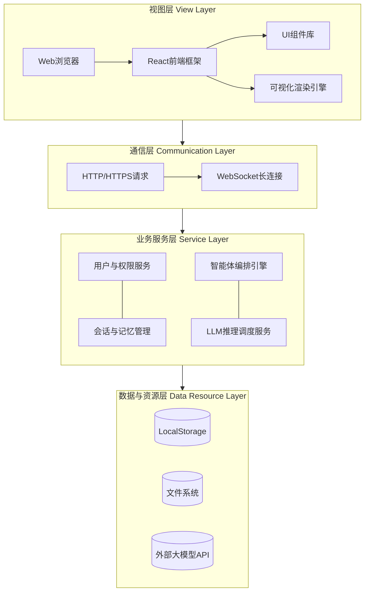

```mermaid
graph TB
    subgraph ViewLayer [视图层 View Layer]
        direction LR
        V1[Web浏览器] --> V2[React前端框架]
        V2 --> V3[UI组件库]
        V2 --> V4[可视化渲染引擎]
    end

    subgraph CommLayer [通信层 Communication Layer]
        direction LR
        C1[HTTP/HTTPS请求] --> C2[WebSocket长连接]
    end

    subgraph ServiceLayer [业务服务层 Service Layer]
        direction TB
        S1[用户与权限服务]
        S2[会话与记忆管理]
        S3[智能体编排引擎]
        S4[LLM推理调度服务]
        
        S1 --- S2
        S3 --- S4
    end

    subgraph DataLayer [数据与资源层 Data Resource Layer]
        direction LR
        D1[(LocalStorage)]
        D2[(文件系统)]
        D3[(外部大模型API)]
    end

    ViewLayer --> CommLayer
    CommLayer --> ServiceLayer
    ServiceLayer --> DataLayer
```

