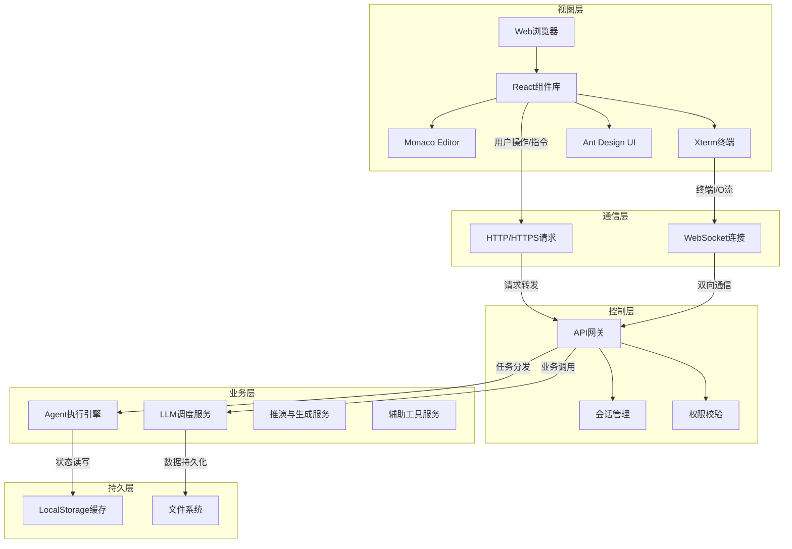

```mermaid
graph TB
    subgraph 视图层
        A1[Web浏览器] --> A2[React组件库]
        A2 --> A3[Monaco Editor]
        A2 --> A4[Xterm终端]
        A2 --> A5[Ant Design UI]
    end

    subgraph 通信层
        B1[WebSocket连接] 
        B2[HTTP/HTTPS请求]
    end

    subgraph 控制层
        C1[API网关] --> C2[会话管理]
        C1 --> C3[权限校验]
    end

    subgraph 业务层
        D1[LLM调度服务]
        D2[Agent执行引擎]
        D3[推演与生成服务]
        D4[辅助工具服务]
    end

    subgraph 持久层
        E1[LocalStorage缓存]
        E2[文件系统]
    end

    A2 -- 用户操作/指令 --> B2
    A4 -- 终端I/O流 --> B1
    B2 -- 请求转发 --> C1
    B1 -- 双向通信 --> C1
    C1 -- 业务调用 --> D1
    C1 -- 任务分发 --> D2
    D2 -- 状态读写 --> E1
    D1 -- 数据持久化 --> E2
```

